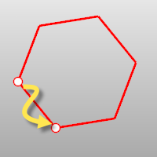
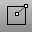
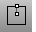

---
---

# Polygon toolbar
{: #kanchor2361}
 [To open a toolbar](javascript:void(0);) Toolbars can be opened as a free-standing group or added to the current group.
To open a toolbar as a free-standing group
Click theOptionsicon in any toolbar group.On the menu, clickShow Toolbar, and then select the toolbar name from the list.To open a toolbar as a new tab in the current group
Click theOptionsicon in the toolbar group where you want to add the new tab.On the menu, clickShow or Hide Tabs, and then select the toolbar name from the list. [Polygon](polygon.html) 
Draw a polygon with a specified number of sides with options for inscribed/circumscribed, by edge, star-shaped, around a curve, and vertical.
 [Polygon, *Circumscribed* ](polygon.html#circumscribed) 
Draw a circumscribed polygon with a specified number of sides.
 [Polygon, *Edge* ](polygon.html#edge) 
Draw a polygon by defining one edge.
 [Polygon, *Square from center and corner* ](polygon.html) 
Draw a square polygon by center and corner.
 [Polygon, *Square from center and edge* ](polygon.html) 
Draw a circumscribed square polygon by center and edge.
 [Polygon, *Square from edge* ](polygon.html) 
Draw a square polygon by edge.
 [Polygon, *Star* ](polygon.html#star) 
Draw a polygon star.
&#160;
&#160;
Rhinoceros 6 © 2010-2015 Robert McNeel &amp; Associates.11-Nov-2015
 [Open topic with navigation](polygon-toolbar.html) 

