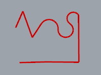
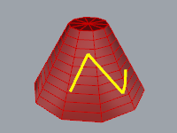

---
---

{: #kanchor1750}{: #kanchor1751}{: #kanchor1752}{: #kanchor1753}
# Polyline
 [Where can I find this command?](javascript:void(0);) Toolbars
 [Lines](lines-toolbar.html)  [Main](main1-toolbar.html)  [Curve Drawing](curve-drawing-toolbar.html) 
Menu
Curve
Polyline
Polyline
Through Points
On Mesh
The Polyline command draws a series of joined line or arc segment.

Note
A polyline consists of line segments that are joined end to end.Use the [Line](line.html) command to create single-segment lines.Use the [Lines](lines.html) command to create multiple touching line segments as separate objects.To draw a polyline
 [Pick](pick-location.html) the start of the first segment.Pick the end of the first segment.This is also the start of the next segment.Pick the end of the next segment.Continue picking until the polyline is complete, and press [Enter](enter-key.html) .Polyline options
Close
Closes the curve.
The Close option appears only after three points have been placed.
Helpers
The Helpers option turns on dynamic tracking tangent and ortho lines that make it easier to extend arcs with lines and draw arcs aligned x and y&#160;axes.
Your browser does not support the video tag.Length
The Length option sets the length for the next line segment.
This option is only available when theModeoption is set toLine.
Mode
The Mode option controls whether line segments or arcs are drawn.
Mode options
Line
The Line option sets the drawing mode to [line segments](line.html).
Arc
The Arc option sets the drawing mode to [arc segments](arc.html).
Arc options
Direction
To use the Direction option, pick a point to show the direction of a line tangent to the arc's first end point.
Your browser does not support the video tag.Center
To use the Center option, pick a center point for the arc's radius.
PersistentClose
The PersistentClose option closes the curve as soon as there are two points placed.
If you continue to pick points, the curve updates the shape while remaining closed.
Undo
The Undo option reverses the last action.

# PolylineOnMesh
{: #polylineonmesh}
 [Where can I find this command?](javascript:void(0);) Toolbars
 [Line](lines-toolbar.html) 
Menus
Curve
Polyline
On Mesh
The PolylineOnMesh command draws a multi-segment polyline on a polygon mesh object.
To draw a polyline on a mesh object
 [Select](select-objects.html) a mesh. [Pick](pick-location.html) the start the polyline.Pick the next segment, and press [Enter](enter-key.html) .See also
 [Draw lines and curves](sak-curve.html) 
&#160;
&#160;
Rhinoceros 6 © 2010-2015 Robert McNeel &amp; Associates.11-Nov-2015
 [Open topic with navigation](polyline.html) 

