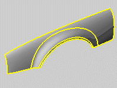

---
---

Polysurface{: #kanchor3099}
A polysurface consists of two or more surfaces joined together. If the polysurface fully encloses a volume, it is also a solid.

Polysurface edges highlighted.
 [Open topic with navigation](polysurface.html) 

