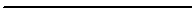
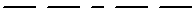
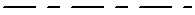
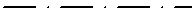
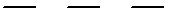
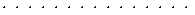
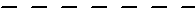

---
---

{: #kanchor1784}{: #kanchor1785}{: #kanchor1786}{: #kanchor1787}{: #kanchor1788}{: #kanchor1789}{: #kanchor1790}{: #kanchor1791}{: #kanchor1792}{: #kanchor1793}{: #kanchor1794}{: #kanchor1795}{: #kanchor1796}{: #kanchor1797}{: #kanchor1798}
# Properties
 [Where can I find this command?](javascript:void(0);) Toolbars
 [Popup](popup-toolbar.html)  [Properties](properties-toolbar.html)  [Standard](standard-toolbar.html) 
Menus
Edit and Panels
Object Properties
Shortcut
F3
The Properties command manages object properties for the selected objects.
Properties panel
 [Panel options](panel-options.html) 
Object{: #object-type}
Type
The object type: curve, surface, polysurface, block name, etc. displays.
{: #name}Name
Object names are stored in the Rhino 3DM file and exported to file formats that accept object names.
{: #layer}Layer
To change the object's layers, select a layer from the list. Layers can be created, and their properties can be changed in the [Layer](layer.html) dialog box.
{: #displaycolor}Display Color
The color of the object can either inherit the color of its layer or be set as an object property.
By Layer
Uses the display color of the object's layer.
By Parent{: #by-parent}
This option is only useful when creating [blocks](block.html).
Before you make a block, assign objects color toBy parent, then make the block and include the object.
The layer that is current when the block is inserted will control the color and visibility of the objects that were set toBy parent.
If color is setBy layerorBy object, that color is maintained regardless of which layer was current when the block was inserted or the block reference layer.
Assign the object color to "by parent" in Properties has to happen before the block is made or after in the BlockEdit command.
If an object's properties areBy Parent, the object will continue to draw as if set toBy Layer. However, when the object is part of a block, it takes on the properties of the block instance (layer or property).
Linetypes are not supported in theBy parentsetting.
Example using Parent material
Set the material for Layer 1.Draw a Sphere on Layer 1.Select the sphere, and set its material property toParent.Use the [Block](block.html) command to turn the sphere into a block.Set the material for Layer 2 to a different material.Insert the block from step 4 on Layer 2.The sphere will display the material assigned to Layer 2 because the block instance is on Layer&#160;2, and the objects in the block are assigned their materialBy Parent.Select the block instance, and set its material property to object.The sphere will change to the object material.For nested blocks: Blocks made of nested blocks that include objects set to the Parent material are not affected by further nesting.
Specified color
Uses a specified color.
{: #linetype}Linetype
By Layer
Uses the linetype of the object's layer.
By Parent
This option is only useful when creating [blocks](block.html).
If an object's properties areBy Parent, the object will continue to draw as if set toBy Layer. However, when the object is part of a block, it takes on the properties of the block instance (layer or property).
Specified linetype
Uses a specified linetype:
Continuous

Border

Center

DashDot

Dashed

Dots

Hidden

{: #printcolor}Print Color
By Display
Prints using the display color.
By Layer
Prints using the layer color.
By Parent
Prints using the By Parent color.
Specified color
Prints using the specified color.
{: #printwidth}Print Width
By Layer
Prints using the layer print width.
By Parent
Prints using the By Parent print width.
Default
Prints using the default print width.
{: #noprint}No Print
Does not print.
Specified width
Prints using a specified print width.
{: #hyperlink}Hyperlink
Specifies a web page associated with the object.
{: #meshsettings}Render Mesh Settings
Custom Mesh
Turns custom mesh settings on and off.
Settings
 **Adjust** 
Adjusts [mesh settings](polygon-mesh-detailed-options.html) to control the object mesh density.
Rendering
{: #casts-shadows}Casts shadows
Casts shadows on other objects and a ground plane.
{: #receives-shadows}Receives shadows
Receives shadows from other objects.
{: #isocurvedensity}Isocurve Density

Density
Defines the number of [isoparametric curves](isocurve.html) Rhino draws on the surface.
Value
Display
0
One isocurve at each knot; no isocurves on knot-free spans.
1
One isocurve at each knot, or one isocurve on knot-free spans.
2
One isocurve at each knot, plus one isocurve between knot locations.
3
One isocurve at each knot, plus two isocurves between knot locations.
Show surface isocurve
Visible
Turns display of surface isoparametric curves.
To change the default isoparametric curve density for new objects
Go to [General Options](general.html). **Match** 
Set the properties of the selected object to match properties of another object in the model.
To match properties
 [Select](select-objects.html) an object with the properties to match.Check the boxes for the properties to match. **{: #details}Details** 
Displays technical information about the object displays.
See: [What](what.html).
Object Description
The object type: curve, surface, polysurface, block name, etc. displays.
Object ID
The object's internal identification number.
Layer name
The name of the [layer](layer.html) assigned to the object.
Render Material
The name of the [render material](materialeditor.html) assigned to the object.
Source
Object, layer, or parent.
Index
The layer material index number.
Geometry
Details about the geometry mathematics, edges, vertices, and meshes.

### Text window
Right-click for options.
Undo
Cut
Copy
Paste
Select All
 **Copy All** 
Copies all text in the window to the Clipboard.
 **Save As** 
Saves the contents of the window to a text file.
 **Close** 
Closes the window.
See also
 [Manage object properties](sak-objectproperties.html) 
&#160;
&#160;
Rhinoceros 6 © 2010-2015 Robert McNeel &amp; Associates.11-Nov-2015
 [Open topic with navigation](properties.html) 

