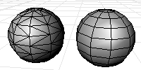

---
---

{: #kanchor1812}{: #kanchor1813}
# QuadrangulateMesh
 [Where can I find this command?](javascript:void(0);) Toolbars
 [Mesh Tools](mesh-tools-toolbar.html) 
Menus
 [Not on menus.](menuwhattodo.html) 
The QuadrangulateMesh command merges mesh triangles into quadrangles.
Diagonals that are [unwelded](weld.html) (have unique vertexes at the corners) will not be considered as candidates for merging triangles into quadrangles.

Steps
 [Select](select-objects.html) mesh objects.Options
Planarity
The angle between the face normals of the triangles.
Rectangularity
Specify a number greater than or equal to 1. If the adjacent triangles pass the planarity test then they will be merged into a quadrangle if the largest ratio of the lengths of the diagonal is less than or equal to the number you typed, then the triangles are converted to quadrangle.
See also
 [Edit mesh objects](sak-meshtools.html) 
&#160;
&#160;
Rhinoceros 6 © 2010-2015 Robert McNeel &amp; Associates.11-Nov-2015
 [Open topic with navigation](quadrangulatemesh.html) 

