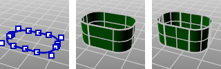

---
---

{: #kanchor1818}{: #kanchor1819}{: #kanchor1820}{: #kanchor1821}
# RailRevolve
 [Where can I find this command?](javascript:void(0);) Toolbars
 [Surface Creation](surface-creation-toolbar.html)  [Surface Sidebar](surface-sidebar-toolbar.html) 
Menus
Surface
Rail Revolve
 [&#160;History enabled](historyenabled.html) 
&#160; [Crease splitting enabled](creasesplttingenabled.html) 
The RailRevolve command creates a surface by revolving a profile curve that defines the surface shape around a rail curve that defines the surface edge.
Steps
 [Select](select-objects.html) a profile curve.Select a rail curve. [Pick](pick-location.html) the start of the revolve axis.Pick the end of the revolve axis.Your browser does not support the video tag.Options
ScaleHeight
The profile curve, in addition to being revolved, stretches along the revolve axis using the revolve axis origin as the scale base point. The distance from the revolve axis origin to the path curve start point along the revolve axis is the primary reference height, and the distances from the revolve axis origin to path curve [control points](controlpoint.html) along the revolve axis are the secondary reference heights.
You do not need ScaleHeight option if the rail curve is planar and perpendicular to the revolve axis. In this case, the result looks exactly the same both ways. This is the way RailRevolve is normally used.
Use the ScaleHeight option if the rail curve is not on a plane perpendicular to the revolve axis and you want a part of the profile curve to only revolve around the revolve axis, not to move along the revolve axis as it is revolved. This is the case if you want to build rail-revolved surfaces with smooth round ends even if the rail curve is not planar.
With the ScaleHeight option, the revolve axis origin location matters. The revolve axis origin is also the scale origin. The one-dimensional scaling happens parallel to the revolve axis.
If the rail curve is closed, the seam must be where the profile touches the rail for good results.
Your browser does not support the video tag.SplitAtTangents
Yes
Creates a single surface.
No
Creates a polysurface when the input curves are joined tangent curves. Faces in the resulting polysurface correspond to the tangent sub-curves in the input curves.

Original polycurve (left), SplitAtTangents=No (center), SplitAtTangents=Yes (right).
Note
When this option is used, the output will be a polysurface.When [UseExtrusions](useextrusions.html) is on, this setting has no effect.See also
 [Create surfaces](sak-surface.html) 
&#160;
&#160;
Rhinoceros 6 © 2010-2015 Robert McNeel &amp; Associates.11-Nov-2015
 [Open topic with navigation](railrevolve.html) 

