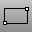
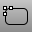
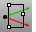

---
---

# Rectangle toolbar
{: #kanchor2364}
 [To open a toolbar](javascript:void(0);) Toolbars can be opened as a free-standing group or added to the current group.
To open a toolbar as a free-standing group
Click theOptionsicon in any toolbar group.On the menu, clickShow Toolbar, and then select the toolbar name from the list.To open a toolbar as a new tab in the current group
Click theOptionsicon in the toolbar group where you want to add the new tab.On the menu, clickShow or Hide Tabs, and then select the toolbar name from the list. [Rectangle](rectangle.html) 
Draw a rectangular closed polyline from with options for starting at the center, three points, vertical, and rounded with arc or conic corners.
 [Rectangle, *3Point* ](rectangle.html#3point) 
Draw a rectangle through three points.
 [Rectangle, *Center* ](rectangle.html#center) 
Draw a rectangle from a center point and corner point.
 [Rectangle, *Rounded* ](rectangle.html#rounded) 
Draw a rectangle with rounded corners.
 [Rectangle, *Rounded, conic corners* ](rectangle.html#rounded) 
Draw a rectangle with conic rounded corners.
 [Rectangle, *Vertical* ](rectangle.html#vertical) 
Draw a rectangle perpendicular to the construction plane.
&#160;
&#160;
Rhinoceros 6 © 2010-2015 Robert McNeel &amp; Associates.11-Nov-2015
 [Open topic with navigation](rectangle-toolbar.html) 

