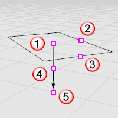

---
---

{: #kanchor1835}{: #kanchor1836}{: #kanchor1837}{: #kanchor1838}{: #kanchor1839}{: #kanchor1840}
# RectangularLight
 [Where can I find this command?](javascript:void(0);) Toolbars
 [Lights](lights-toolbar.html)  [Rende](render-tools-toolbar.html)  [r Tools](render-tools-toolbar.html) 
Menus
Render
Create Rectangular Light
The RectangularLight command inserts a rectangular light object that emits light from an array of light points in one direction.

Location point (1), length control (2), width control (3), dolly point (4), target point (5).
Note
Turn on the light's control points and move or drag the control points to edit the light's direction, length, width, and target.To move the light without changing its direction, move the *dolly point* (the control point at the midpoint on the direction vector).Steps
 [Pick](pick-location.html) the light's start point.Pick a the light's length.Pick the light's width.Command-line options
Target
Aims the light at the specified location.
See also
 [DirectionalLight](directionallight.html) 
Insert a light with parallel rays pointing in a direction.
 [LinearLight](linearlight.html) 
Insert a tubular light.
 [PointLight](pointlight.html) 
Insert an omni-directional light.
 [Spotlight](spotlight.html) 
Insert a light cone object.
 [Lights](lights.html) 
Open the Lights panel.
 [Render](render.html) 
Render the objects using the current renderer.
 [Add lights](sak-lights.html) 
&#160;
&#160;
Rhinoceros 6 © 2010-2015 Robert McNeel &amp; Associates.11-Nov-2015
 [Open topic with navigation](rectangularlight.html) 

