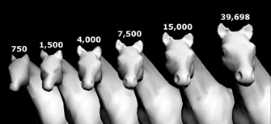
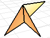

---
---

{: #kanchor1856}
# ReduceMesh
 [Where can I find this command?](javascript:void(0);) Toolbars
 [Mesh Tools](mesh-tools-toolbar.html) 
Menus
Mesh
Mesh Edit Tools
Collapse
Reduce Vertex Count
The ReduceMesh command decreases the polygon mesh face count while minimizing geometric and texture distortion.

Note
The mesh is first triangulated, its polygon count is reduced, and the resulting triangular mesh is quadrangulated again.Nonmanifold meshes (meshes whose edges are shared by more than two faces) may result. This may be undesirable in some cases.Steps
 [Select](select-objects.html) mesh objects.Set the new polygon count.Reduce Mesh Options
Starting polygon count
The number of triangles after all quadrangles are split.
Each quadrangle converts into two triangles, but some may not convert back to quadrangles, so it is possible that reducing the mesh may result in more faces than the starting number.
Reduce to ___ polygons
Specifies the desired number of polygons.
Reduce by ___ percent
Specifies reduction by a percentage of the starting polygon count.
Planar only
Restricts reduction to planar polygons.
Fast &lt;—|—&gt; Accurate
Fast
Trades speed for accuracy during conversion. Reduction is performed more randomly, involving fewer calculations, and is therefore faster.
Accurate
Produces the fewest visible artifacts. This involves more calculations and is therefore slower.
 **Preview** 
Displays a preview of the output.
If you change the settings, click **Preview** again to refresh the display.
See also
 [Edit mesh objects](sak-meshtools.html) 
&#160;
&#160;
Rhinoceros 6 © 2010-2015 Robert McNeel &amp; Associates.11-Nov-2015
 [Open topic with navigation](reducemesh.html) 

