---
---

{: #kanchor2948}{: #kanchor2949}{: #kanchor2950}{: #kanchor2951}{: #kanchor2952}{: #kanchor2953}{: #kanchor2954}{: #kanchor2955}{: #kanchor2956}{: #kanchor2957}{: #kanchor2958}{: #kanchor2959}{: #kanchor2960}{: #kanchor2961}{: #kanchor2962}{: #kanchor2963}{: #kanchor2964}{: #kanchor2965}{: #kanchor2966}{: #kanchor2967}{: #kanchor2968}{: #kanchor2969}{: #kanchor2970}{: #kanchor2971}{: #kanchor2972}{: #kanchor2973}
# Post-processing rendered images
The standard render window includes built in support for cloning, saving to High-Dynamic-Range formats, post effects, zooming and channel display.

## Toolbar
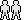Clone Window
Causes the current render window to be cloned to a second window. All channels and post-effect settings are preserved.
{: #save-as}Save As
Saves the rendered image to an image file. The render window also contains built in support for HDRi and OpenEXR output, but these formats need to be enabled by the renderer.
File types supported
Windows Bitmap (.bmp)JPEG - JFIF Compliant (.jpg, .jpeg, .jpe)Portable Network Graphics (.png)Tagged Image File Format (.tif, .tiff)Truevision Targa (.tga)HDRi files (.hdr, .hdri)OpenEXR files (.exr)Rhino Renderings (.rimage){: #copy}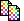Copy
Copies the image to the Clipboard.
Show RGB Channels
Shows all of the color components in the image.
See: [Wikipedia: Channel (digital image)](http://en.wikipedia.org/wiki/Channel_(digital_image)).
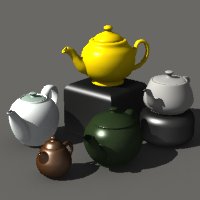
Show Red Channel
Displays only the red component.
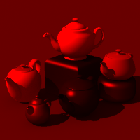
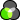Show Green Channel
Displays only the green component.
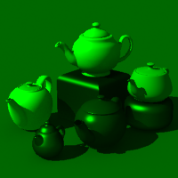
Show Blue Channel
Displays only the blue component.
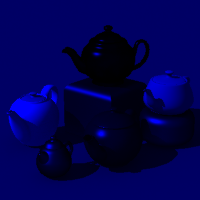
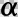Show Alpha Channel
Displays only the alpha (transparency) component.
See: [Webopedia: Alpha channel](http://www.webopedia.com/TERM/A/alpha_channel.html).

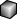Show Depth Channel
Displays the z-buffer (depth information ) as grayscale.
See: [Wikipedia: Z-Buffering](http://en.wikipedia.org/wiki/Z-buffering).
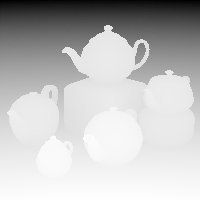
Open Effects Panel
Opens the [Effects Panel](#effects-panel) where you can adjust the image exposure and add post-processing effects.
Stop Rendering
Aborts the rendering process.

## File menu
Clone Window
Causes the current render window to be cloned to a second window. All channels and post-effect settings are preserved.
Open
Opens a saved Rhino Rendering file (.rimage). This format is a lossless format that includes all channels. These files can be opened later for adding [post-processing effects](#effects-panel).
Save As
Saves the rendered image to an image file. The render window also contains built in support for HDRi and OpenEXR output, but these formats need to be enabled by the renderer.
File types supported
Windows Bitmap (.bmp)JPEG - JFIF Compliant (.jpg, jpeg, .jpe)Portable Network Graphics (.png)Tagged Image File Format (.tif, .tiff)Truevision Targa (.tga)HDRi files (.hdr, .hdri)OpenEXR files (.exr)Rhino Renderings (.rimage)Print
Prints the rendered image to a printer.
The printing controls are basic and do not support the kind of color management a high-quality image printing system would. The recommended way to print rendered images is to save the image and transfer to a dedicated image-processing application.
Recent
Opens recently rendered images. These images are saved automatically in Rhino Rendering (.rimage) file format.
Exit
Closes the Render Window.

## Edit menu
Copy
Copies the image to the Clipboard.

## View menu
Toolbar
Shows/Hides the toolbar.
Effects Panel
Opens the [Effects Panel](#effects-panel) where you can adjust the image exposure and add post-processing effects.
Show Rendered Image
Shows/Hides the image.
Zoom
Zooms the image, increasing or decreasing the pixel size in the window.
Channels
Default (RGB)
Shows all of the color components in the image.
See: [Wikipedia: Channel (digital image)](http://en.wikipedia.org/wiki/Channel_(digital_image)).

Red
Displays only the red component.

Green
Displays only the green component.

Blue
Displays only the blue component.

Alpha
Displays only the alpha (transparency) component.
See: [Webopedia: Alpha channel](http://www.webopedia.com/TERM/A/alpha_channel.html).

Z-Buffer
Displays the z-buffer (depth information ) as grayscale.
See: [Wikipedia: Z-Buffering](http://en.wikipedia.org/wiki/Z-buffering).

Normal X
Displays normals in the x&#160;direction as grayscale.
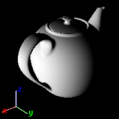
Normal Y
Displays normals in the y&#160;direction as grayscale.
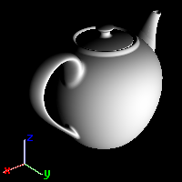
Normal Z
Displays normals in the z&#160;direction as grayscale.
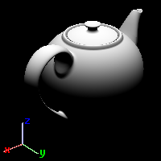
Dithering
A form of noise used to randomize quantization error, preventing large-scale patterns such as banding in images.
See: [Wikipedia: Dither](http://en.wikipedia.org/wiki/Dither).
None
No dithering is applied.
Floyd-Steinberg
Commonly used algorithm by image manipulation software, for example when an image is converted into GIF format that is restricted to a maximum of 256 colors.
Simple Noise
Randomly applied noise.

## Help menu
Displays the Help topic for the current renderer.

## Effects Panel
{: #effects-panel}
Controls the post-processing effects available for the rendered image.

### Exposure Tab
The Exposure tab controls gamma correction and tone mapping.
Gamma correction
Image files are color corrected so that they can be loaded byte-by-byte into the RGB pixels of a computer screen and look right on a monitor. This means that the color response of a standard image is non-linear, that is, it is gamma corrected. Gamma refers to the power function that is used to correct the image.
The Gamma value changes, and therefore corrects the output of the image.
See: [Wikipedia: Gamma correction](http://en.wikipedia.org/wiki/Gamma_correction).
Use linear workflow
Gamma correction for bitmap images that are loaded from disk is removed (by the inverse of the amount in theGammaedit box) so that they have a linear response before they are passed to the renderer. The renderer renders them in this uncorrected state. The gamma correction is applied to the entire finished image. This can do a better job of processing the color in rendered images.
See: [What is linear work flow and how can it help your renders look better](http://greyscalegorilla.com/blog/2010/11/what-is-linear-workflow-and-how-can-it-help-your-renders-look-better/).
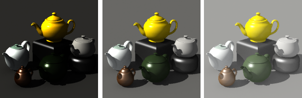
Gamma less than 1 (left), at the default value of 1 (center), and greater than 1 (right).
{: #tone-mapping}Tone mapping
Tone mapping is the process of converting an high-dynamic-range image into a low-dynamic-range image. HDR means the pixel values can have red, green, and blue values that can be represented by a 32-bit floating point number. These values can either be smaller than 1 which means there will be a quantizing error (fixed using dithering), or they can be above 1.0 which might mean they are brighter than the maximum value of the color channel on a monitor (for example, more than 255).
When values are "brighter than white," they will be burned out on the screen. They can be brought back into the screen/bitmap color gamut using tone mapping, which is the process of remapping the color in an image so that the brighter areas are better represented. The options offer a number of ways of doing this.
See: [Wikipedia: High dynamic range imaging](http://en.wikipedia.org/wiki/High_dynamic_range_imaging).
Black / White point
Linear interpolation between two points that are specified as black and white. In a normal image, these are 0.0 and 1.0.
Black point
Specifies the numerical value for the black point.
White point
Specifies the numerical value for the white point.
Logarithmic
Changes the response curve to a power function so that the upper range is slowly given less prominence. It is based on logarithmic compression of luminance values, imitating the human response to light.
See: [Adaptive Logarithmic Mapping For Displaying High Contrast Scenes, by F. Drago, K. Myszkowski, T. Annen and N. Chiba](http://resources.mpi-inf.mpg.de/tmo/logmap/).
Histogram
A graphical representation of the tonal distribution in a digital image. It plots the number of pixels for each tonal value. By looking at the histogram for a specific image, you can judge the entire tonal distribution at a glance.
See: [Wikipedia: Image histogram](http://en.wikipedia.org/wiki/Image_histogram) 
Set As Doc. Defaults
Show this panel by default

### Post Effects Tab
The Post Effects tab shows all of the post-processing effects available.
You can enable and disable effects, re-order them using theMove UpandMove Downbuttons and edit their properties. Effects at the top of the list are executed first.
Post-processing effects can be applied after the image is rendered to add a special effect or effects.
Toolbar
On
Turn the selected effects on/off.
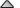Move up
Move the effect up in the list. This causes the effect to process before the effects lower in the list.
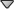Move down
Move the effect down in the list. This causes the effect to process after the effects higher in the list.
Properties
Opens the properties page for the specified effect.
Save to defaults
Saves the effects list as the default settings for future renderings.

### Fog
The fog effect adds depth-dependent coloration in the image and can be used to add anything from a thick fog effect to a subtle depth cue. In this way it is similar to the environment based Haze, but instead of being rendered at raytrace time, it is added afterward and can be adjusted in real time.
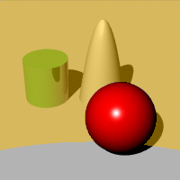
Fog Properties
Visual properties
Strength
Determines the maximum amount of fogginess. 0.0 means no fog at all (and therefore no effect), 1.0 represents total fog. Values higher than 1.0 can be used but only make sense when used with noise.
Noise
Adds a random variation to the fog strength.
Fog Color
Adjusts the color of the fog.
 **Pick** 
Picks the color from the rendered image.
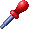Click the image to pick a color.
Area of Effect
Start distance
Specifies the distance from the camera at which the fog begins to appear.
Pick
Picks the depth from the rendered image.
End distance
Specifies the distance from the camera at which the maximum amount of fogginess is achieved.
 **Pick** 
Pick the depth from the rendered image.
Bounds
Top / Right / Left / Bottom
Specifies the area of the image affected by the fog. This can be used to create a low lying mist effect.
Pick Area
Pick the area in the image.
Fog Background
Determines whether the background image is also made foggy. The background will be fogged at the maximum strength.
Feathering
Determines the number of pixels outside the bounding area to fade in the fogginess.
 **Preview** 
Preview the effect on the image as you change the values in the dialog box.
Hold [Ctrl](ctrl-key.html), [Shift](shift-key.html), or [Alt](alt-key.html) to see an immediate preview as you change the numbers using a spinner control.

### Glow
Produces a bright area around specific colors. It can be used to make colored lights or objects appear to glow and works well with neon type lights.
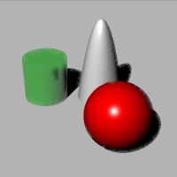
Glow Properties
Visual Properties
On
Turns glow on for the color.
Color
Select up to 10 colors to affect in the image.
Click the color swatch to pick a color in the rendered image.
Click the image to pick a color.
Sensitivity
Controls how much variation on the selected color is permitted when calculating glow on pixels close to that color.
Glow Size
Determines the radius of the glow around the bright pixel.
Gain
Multiplier for the lightness of the glow. The default value of 1.0 should result in normal glow effects. Higher values can be used for extremely bright glow.
 **Preview** 
Preview the effect on the image as you change the values in the dialog box.
Hold [Ctrl](ctrl-key.html), [Shift](shift-key.html), or [Alt](alt-key.html) to see an immediate preview as you change the numbers using a spinner control.

### Glare
Glare makes extremely bright parts of the image appear to glare. It does this by making the area surrounding the bright area brighter too. The effect is usually used for night scenes where it will make the lights seem much more realistic.
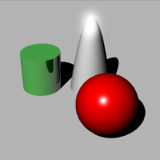
Glare Properties
White point bound
This value determines where in the tonal range the glare will begin. It’s value is represented on the histogram at the bottom of the dialog and can also be adjusted graphically. Pixels lighter than the bound (either in luminance or the gray-scale value depending on the photometric mode) will glare.
Glare Size
Determines the radius of the glare around the bright pixel.
Gain
Multiplier for the lightness of the glare. The default value of 1.0 should result in normal glare effects. Higher values can be used for extremely bright glare.
Use photometric information
Determines the glare mode. This check box is unavailable if there is no luminance information in the image (it was rendered with the simple raytracer). When using photometric glare, the amount of glare is controlled by how “whiter than white” the pixel is. Otherwise the effect uses the whitest pixels in the image.
 **Preview** 
Preview the effect on the image as you change the values in the dialog box.
Hold [Ctrl](ctrl-key.html), [Shift](shift-key.html), or [Alt](alt-key.html) to see an immediate preview as you change the numbers using a spinner control.

### Depth of Field
{: #depthoffield}
Blurs the image depending on the distance from the camera.
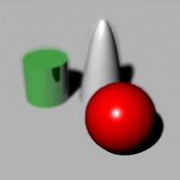
Depth of Field Properties
Visual properties
Blurring Strength
Determines the amount of blurring. This is an arbitrary value and you will find different values will work better with different images.
Max Blurring
Determines the maximum Gaussian blurring radius used. Since extremely blurred areas can cause the effect to be slow, this limits the effect.
Area of Effect
Focal distance
The distance from the camera at which the image is not blurry – in focus.
Pick
Pick the distance from the rendered image.
Blur background
Determines whether the background is blurry. The background will be blurred at the maximum effect.
 **Preview** 
Preview the effect on the image as you change the values in the dialog box.
Hold [Ctrl](ctrl-key.html), [Shift](shift-key.html), or [Alt](alt-key.html) to see an immediate preview as you change the numbers using a spinner control.

### Points, Curves, Isocurves, Annotations
Determines whether the wireframe objects are displayed in the render window.
These post effects have no options. They are either on or off.
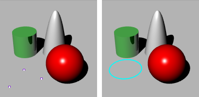
Points on (left), Curves on (right).
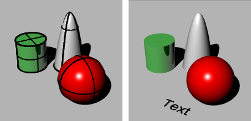
Isocurves on (left), Annotations on (right).

### Hue
Adjusts the material color after rendering.
The idea is this way you can try different color combinations without having to re-render the whole scene.
Since the hue adjuster works on the pixels of the rendered image, it has no knowledge of what contributed to the color of the pixel other than the topmost object. For example reflections of the object on other objects and parts of the object seen through transparent objects will not update.
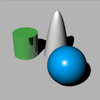
Hue Properties
Material 1 / 2 / /3
Up to three material colors at a time can be changed.
Eye dropper
Select an object with a color from the image to change. The hue post process only affects objects with color other than white, neutral gray, or black.
Color preview swatch
Displays the current color.
Hue change value
Changes the hue. All objects using the same material will be updated.
 **Preview** 
Preview the effect on the image as you change the values in the dialog box.
Hold [Ctrl](ctrl-key.html), [Shift](shift-key.html), or [Alt](alt-key.html) to see an immediate preview as you change the numbers using a spinner control.
Reset
Changes the settings back to the default values.

### Saturation
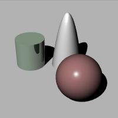
Saturation Properties
Saturation
Sets the saturation amount. The smaller the saturation, the more monochromatic the image.
Tint
Defines the color that will replace medium gray when saturation is set to zero. For example if you want to make a sepia shade rendering, set the Tint color to greyish olive/brown, and setSaturationto zero.
 **Preview** 
Preview the effect on the image as you change the values in the dialog box.
Hold [Ctrl](ctrl-key.html), [Shift](shift-key.html), or [Alt](alt-key.html) to see an immediate preview as you change the numbers using a spinner control.
 **Reset** 
Changes the settings back to the default values.

### Focal Blur
Focal blur is a quick version of the [Focal Blur Document Properties](rhino-render.html#rhinorender-focal-blur). The parameters are compatible with 35mm single-lens-reflex camera and depend on the camera lens length in the viewport to render.
The quick focal blur is done by going through the image pixel by pixel, determining the size of the pixel based on the depth, and pasting each pixel back to a new image. Pixels at focal plane are smaller and stronger, and pixels away from the focal plane are bigger and weaker.
The quick focal blur is only an estimate. It cannot add any information to the scene, so, for example, objects in focus partially visible behind an object completely out of focus will not look as good and realistic as the same scene rendered with slow focal blur that actually traces additional rays to create the effect.
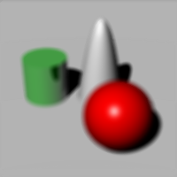
Focal Blur Properties
Focal distance
The distance from Rhino camera location to the plane perpendicular to it that should be in focus. The real-world equivalent is the focus ring on a SLR camera.
Aperture
The bigger the number, the deeper the area in focus. The smaller the number, the shorter the area in focus.
Update slow focal blur settings in document properties.
The focal distance and aperture are copied to Rhino Render document settings so that a subsequent render using slow and accurate focal blur will use the settings.
 **Preview** 
Preview the effect on the image as you change the values in the dialog box.
Hold [Ctrl](ctrl-key.html), [Shift](shift-key.html), or [Alt](alt-key.html) to see an immediate preview as you change the numbers using a spinner control.
Reset
Changes the settings back to the default values.

### Gaussian Blur
Adds Gaussian blur to the image. The number is the radius of the blur kernel, equivalent to the same setting in paint applications.

Gaussian Blur Properties
Horizontal
Specifies the blurring to be horizontal. This can be used to create a horizontal motion blur effect.
Vertical
Specifies the blurring to be vertical. This can be used to create a vertical motion blur effect.
Both
Blurs in both directions.
 **Preview** 
Preview the effect on the image as you change the values in the dialog box.
Hold [Ctrl](ctrl-key.html), [Shift](shift-key.html), or [Alt](alt-key.html) to see an immediate preview as you change the numbers using a spinner control.
Reset
Changes the settings back to the default values.

### Noise
Noise adds noise to the image.
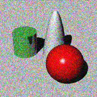
Noise Properties
Noise
By default RGB channels are separated, so adding noise to a gray-scale image makes individual pixels shift towards random color.
Monochromatic
Only the darkness/lightness of the pixel is altered. The color stays the same.
 **Preview** 
Preview the effect on the image as you change the values in the dialog box.
Hold [Ctrl](ctrl-key.html), [Shift](shift-key.html), or [Alt](alt-key.html) to see an immediate preview as you change the numbers using a spinner control.
Reset
Changes the settings back to the default values.

## Rhino Image File Format (.rimage)
Rhino Render can save .rimage files. This is a proprietary file format that stores all of the information rendered by the rendering engine, including color, alpha, depth, normal channels, all with 32-bit per-channel resolution.{: #kanchor2974}{: #kanchor2975}
This information is used by the render window to execute the post-effects and exposure operators, and can also be used by custom controls implemented by a third-party renderer to achieve other effects.
Immediately after render time, the .rimage format can be used to store the data so that post-processing and exposure adjustments or format changes (saving in a different format without loss of information) can be done later.
The .rimage format is only supported by the Rhino render window. It cannot be loaded into any other software. It is a high-dynamic range format that supports lossless information transfer to .HDR and .EXR formats. It is uncompressed and the files can be huge.
To open an .rimage file
In the Rhino render window, on the File menu, click Open.OrUse the [RenderOpenRenderImage](render.html#renderopenrenderimage) command to open an .rimage file without having a render window open.Completed renderings are saved in the .rimage format to a temporary location on your hard disk. Once one of the renderings is re-opened, all post effects and exposure settings are available as if the rendering were just completed.
To open the most recent .rimage file
In the Rhino render window, on the File menu, click Recent, and then choose a file.The files are named the by date and time of the rendering.For more information about post processing the rendered image, see: [Post-processing rendered images](#).
See also
 [Render your model scene](sak-render.html) 
 [Add lights for rendering](sak-lights.html) 
 [Use materials and textures](sak-materialsandtextures.html) 
&#160;
&#160;
Rhinoceros 6 © 2010-2015 Robert McNeel &amp; Associates.11-Nov-2015
 [Open topic with navigation](renderwindowpostprocess.html) 

