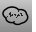
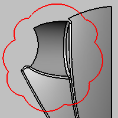

---
---

{: #kanchor1875}
# RevCloud
 [Where can I find this command?](javascript:void(0);) Toolbars
 [Dimension](dimension-toolbar.html) 
Menus
Dimension
Revision Cloud
The RevCloud command draws a revision cloud polycurve.

Steps
 [Pick](pick-location.html) the start point of the revision cloud curve.Draw the curve counter-clockwise to make the arc segments bulge away from the center of the cloud.Continue picking segments, and press [Enter](enter-key.html) when done.Command-line options
Curve
Converts an existing curve to a revision cloud curve.
Angle
The angle of the arc between 90 and 180. This indicates the amount of bulge in the segments.
Divide
Specifies the number of bulge segments.
Length
Specifies the chord length of the bulge segments
Close
Closes the curve.
The Close option appears only after three points have been placed.
Flip
Reverses the [direction](dir.html#normaldirection).
Undo
The Undo option reverses the last action.
See also
 [Use drafting tools](sak-drafting.html) 
 [Utility functions](sak-utilities.html) 
&#160;
&#160;
Rhinoceros 6 © 2010-2015 Robert McNeel &amp; Associates.11-Nov-2015
 [Open topic with navigation](revcloud.html) 

