---
---

{: #kanchor2650}{: #kanchor2651}{: #kanchor2652}{: #kanchor2653}{: #kanchor2654}{: #kanchor2655}{: #kanchor2656}{: #kanchor2657}{: #kanchor2658}{: #kanchor2659}{: #kanchor2660}{: #kanchor2661}{: #kanchor2662}{: #kanchor2663}
# Render
 [Where can I find this command?](javascript:void(0);) Toolbars
 [File](file-toolbar.html)  [Properties](properties-toolbar.html)  [Standard](standard-toolbar.html) 
Menus
File
Properties
Settings
TheRender Document Propertiespage manages the Rhino Render settings for the current model.
The basic renderer supports spot, point, directional, rectangular, and linear lights.
This information is also displayed as a panel.
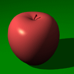
Before you start the command
On theRendermenu, clickCurrent Renderer, and then clickRhino Render.For information about assigning render materials to objects and layers, see [Material Editor](materialeditor.html) .Resolution and Quality
Resolution
The aspect ratio displays to the right of the menu.
Viewport (&lt;size&gt;)
Renders the active viewport the active viewport using the pixel size of the viewport.
Custom (&lt;size&gt;)
Renders the active viewport using the custom resolution. Type the custom width and height resolution in pixels.
Preset sizes
Renders the active viewport the selected pixel resolution.
If you add a text file namedrender_sizes.txtto the folder where the Rhino executable (.exe) resides, Rhino Render and some other renderers will read this text file for custom render sizes.
Example:
// My custom render sizes500,500600,600700,700800,800900,900
Lock to viewport aspect ratio
Maintains the aspect ratio of the viewport. When the height or width is changed, the other dimension changes in relation.
Size
Calculates the size of the image in the selected unit system based on the Resolution and DPI settings. This is useful for determining the size of the image for printing.
Units
Sets the image size in pixels, inches, millimeters, or centimeters.
DPI
Image pixels per inch.
Quality
TheQualitysettings help to improve:
Jagged edges and moiré problems.Noisy "grain" when using the [Skylight](#skylight), [Polish](materialeditor.html#reflection-polish), and [Frost](materialeditor.html#transparency-frost) settings, [rectangular](rectangularlight.html) and [linear](linearlight.html) lights, and [depth of field](renderwindowpostprocess.html#depthoffield) .Grain problems on high contrast textures viewed from distance.Higher quality settings result in more rays being cast per pixel, and as a result the rendering time will increase. Prefer lower quality settings when setting up your scene, but higher settings when producing a final image for presentation purposes.
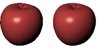
Quality=Draft quality (left), and Final quality (right).
Rhino calculates each pixel in the rendered image by averaging several samples. This makes the image appear smoother, but also slows down rendering.
Backdrop
The backdrop is what you see directly in front of the camera if there are no objects in the way. The background is not 3&#8209;D — it exists only on the screen.
Solid color
Displays a solid color.
To select the color for the background
Click the [color swatch](colorswatch.html) .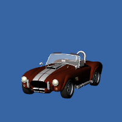
Gradient
Displays a two-color gradient. The color for the top of the image background is theSolid colorset above.
To select the color for the bottom of the background
Click the [color swatch](colorswatch.html) .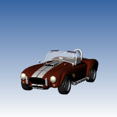
360° Environment
Displays the portion of the [current environment](environmenteditor.html) that the camera sees in the viewport.
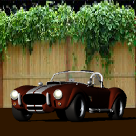
New
Creates a new environment using a template from the library.
Edit
Edits the selected environment.
See: [Environment Editor](environmenteditor.html).
Duplicate
Copies the selected environment to a new environment with the same settings.
Default environments
Three basic environments are included to get you started.
No environment
TheNo environmentsetting applies a plain gray background.
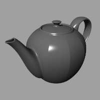
Studio
TheStudioenvironment offers soft lighting provided by a high-dynamic range image.
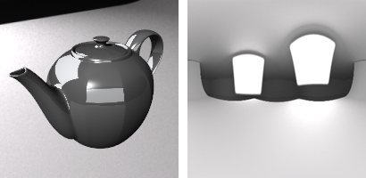
Studio lighting example (left) and hdr background (right).
Rhino Sky
TheRhino Skyenvironment offers lighting from a high-dynamic range image of the sky.
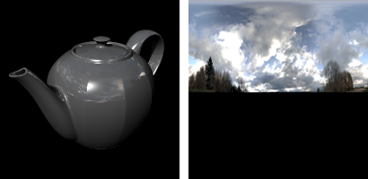
Rhino sky example (left) and hdr background (right).
Wallpaper
Displays the current [viewport wallpaper](viewport.html#wallpaper).
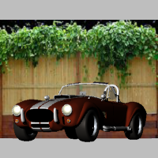
Wallpaper in perspective viewport.
Stretch to fit
Fits the wallpaper to the rendered view.
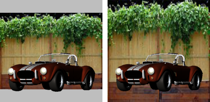
Wallpaper at normal aspect ratio (left) and stretched to fit (right).
Transparent background
The background is rendered with an alpha channel for transparency. The image must be saved to a file format that supports alpha channel transparency (.png, .tga, .tif).
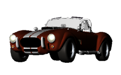
Ground plane
Turns on the ground plane.
 **Ground Plane Settings** 
Opens the [Ground Plane panel](groundplane.html).
Use custom environment for reflections
Assigns a [custom environment](environmenteditor.html) that will be reflected by objects in the scene.
New
Creates a new environment using a template from the library.
Edit
Edits the selected environment.
See: [Environment Editor](environmenteditor.html).
Duplicate
Copies the selected environment to a new environment with the same settings.
Lighting
Sun
Turns on the sun.
 **Sun Settings** 
Opens the [Sun](sun.html) panel.
{: #skylight}Skylight
Turns on [skylight](#skylight).
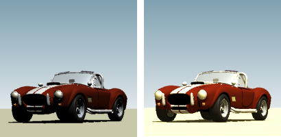
Skylight off (left) and Skylight on (right).
Intensity
Adjusts the skylight intensity.
Use custom environment for skylighting
Sets an [environment](environmenteditor.html) that is used as sky light.
New
Creates a new environment using a template from the library.
Edit
Edits the selected environment.
See: [Environment Editor](environmenteditor.html).
Duplicate
Copies the selected environment to a new environment with the same settings.
 **Lights** 
Opens the [Lights](lights.html) panel.
{: #ambient}Ambient light
Sets the color of the darkest spot on the objects in the scene in the rendered image. The color of the low light areas of the model is a blend of the object color and the ambient light color.
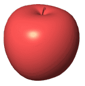
Use lights on layers that are off
Controls whether or not spotlights that are on hidden layers or that are hidden with the [Hide](hide.html) command are rendered.
Wireframe
Render curves
Curve objects are rendered with the surfaces.
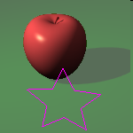
Render surface edges and isocurves
Surface isoparametric curves and edges are rendered with the surfaces. Edge thickness set in the [Rendered viewport](view-displaymodes-rendered.html) apply.
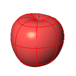
Render dimensions and text
Dimensions and texts are rendered with the surfaces.
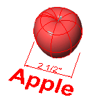
Dithering and color adjustment
Dithering
The rendered image is usually produced at a higher color depth than monitors and low-dynamic-range file types like bitmaps like JPEG, PNG, BMP can reproduce. The most important effect this causes is banding, which is a quantization error. Dithering reduces quantization errors and so gets rid of banding.
Both dithering methods, generally do the same thing. Sometimes, one might be better than the other, but in general, Simple Noise is the best.
See: [Wikipedia: Dither](http://en.wikipedia.org/wiki/Dither) 
None
No dithering.
Floyd-Steinberg
The algorithm achieves dithering by diffusing the quantization error of a pixel to its neighboring pixels.
See: [Wikipedia: Floyd-Steinberg dithering](http://en.wikipedia.org/wiki/Floyd%E2%80%93Steinberg_dithering).
Simple noise
A random variation of brightness or color information in images.
See: [Wikipedia: Image noise](http://en.wikipedia.org/wiki/Image_noise).
Gamma
Image files are color corrected so that they can be loaded byte-by-byte into the RGB pixels of a computer screen and look right on a monitor. This means that the color response of a standard image is non-linear, that is, it is gamma corrected. Gamma refers to the power function that is used to correct the image.
The Gamma value changes, and therefore corrects the output of the image.
See: [Wikipedia: Gamma correction](http://en.wikipedia.org/wiki/Gamma_correction).
Use linear workflow
The Rendered display mode supports a linear workflow for accurate color, gamma and lighting computation.
Gamma correction for bitmap images that are loaded from disk is removed (by the inverse of the amount in theGammaedit box) so that they have a linear response before they are passed to the renderer. The renderer renders them in this uncorrected state. The gamma correction is applied to the entire finished image. This can do a better job of processing the color in rendered images.
See: [What is linear work flow and how can it help your renders look better](http://greyscalegorilla.com/blog/2010/11/what-is-linear-workflow-and-how-can-it-help-your-renders-look-better/).
{: #rhinorender-focal-blur}Focal Blur
The focal blur settings are compatible with the focal blur settings in Rhino Render post effects. These settings control the slow but more accurate focal blur that is generated by shooting more rays into the scene.
Perspective camera focal blur
No focal blur
Autofocus on selected objects
Adjusts the focal distance and aperture automatically so that selected objects are rendered sharp.
Sample count
The number of rays per sub-pixel that is generated for the effect. The higher the count the more accurate and smoother the result, and the longer it takes to render.
Jitter
The amount of radial noise added to the ray origins. Bigger jitter makes the image noisier, but also hides the steps in shading caused by combining the image from multiple samples.
Manual focus
Focal distance
The distance to a plane perpendicular to the camera that should be in focus.
Aperture
The 35 mm single-lens-reflex camera equivalent aperture.
Sample count
The number of rays per sub-pixel that is generated for the effect. The higher the count the more accurate and smoother the result, and the longer it takes to render.
Jitter
The amount of radial noise added to the ray origins. Bigger jitter makes the image noisier, but also hides the steps in shading caused by combining the image from multiple samples.
Advanced Rhino Render Settings
Render acceleration grids
Screen grid, cell size: ___ pixels
The width and height of each grid cell in pixels.
The smaller the grid cell size, the more memory it takes and the more memory it takes to build, but the faster the final render.
Spotlight shadow grid, size
The shadow ray is the ray shot from the scene towards each light when the intersection between the eye ray and the scene is found. Usually the lions share of the render time is spent tracing the shadow rays.
To increase calculation speed for the spotlight shadow rays, the render plug-in divides the spotlight cone into rectangular regions, and again builds a sorted list of the objects within each region. This speed increase only applies to spotlights, because they are very similar to the viewports, the light location is like the camera location, and the light cone defines the viewport.
The spotlight grid is defined in number of grid cells instead of pixels, because there is no pixel size associated with lights.
Preventing self-shadowing
Prevents self-shadowing artifacts. When the intersection between the eye ray and the scene is found, the intersection point is moved (offset) towards each light before calculating the shadow ray. The reason is there's always some numerical fuzz in calculating the intersections, and if the point is not offset, the shadow ray might hit the very same polygon again, putting shadows in wrong places. You can see the self shadowing artifacts if you set the setting to zero, and then render the scene.
Ray offset
The amount of offset.
Object &amp; polygon bounding volume hierarchy
A [binary space partitioning](http://en.wikipedia.org/wiki/Binary_space_partitioning) (BSP) tree is another way to increase rendering speed. Instead of testing each polygon one-by-one, the objects and polygons are divided into a tree-like hierarchy based on the location in space.
The renderer builds multiple trees, one that contains the whole object bounding boxes, and one per object that contains the polygons for that object.
The BSP tree takes some time to build and takes some memory. A deeper tree may take longer to build, but may renders faster. A shallow tree is faster to build, but may take a long time to render.
Max tree depth
Controls how many times the scene can be subdivided when building the tree.
The tree depth defaults to Auto, and node size to 1. There should be no need to change these settings unless you render a scene that is so huge that Rhino runs out of memory using the default settings.
Target node size ___ (objects/polygons)
Defines the optimal size for each node that contains the objects or polygons.
Transparency
Max bounces
The transparency bounces setting controls how many times rays that hit transparent objects are traced: 12 means a stack of 12 transparent sheets will render properly, but the 13th sheet will render opaque. To keep the render times reasonable, the limit is 15.
Reflectivity gradient
Max bounces
The reflectivity bounces setting controls how many times rays that hit reflective objects are traced. To keep the render times reasonable, the limit is 15.
See also
 [Render](render.html) 
Render the objects using the current renderer.
 [Render your model scene](sak-render.html) 
&#160;
&#160;
Rhinoceros 6 © 2010-2015 Robert McNeel &amp; Associates.11-Nov-2015
 [Open topic with navigation](rhino-render.html) 

