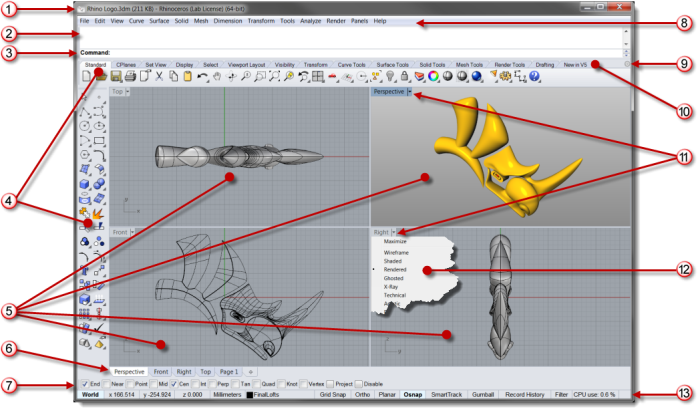

---
---

# The Rhino window
{: #kanchor2474}
{: #kanchor2473}
{: #kanchor2472}
{: #kanchor2471}
{: #kanchor2470}
{: #kanchor2469}
{: #kanchor2468}
{: #kanchor2467}
{: #kanchor2466}
{: #kanchor2465}
{: #kanchor2464}
{: #kanchor2463}
{: #kanchor2462}
{: #kanchor2461}
{: #kanchor2460}
{: #kanchor2459}
{: #kanchor2458}
{: #kanchor2457}
{: #kanchor2456}
{: #kanchor2455}
{: #kanchor2454}
{: #kanchor2453}
{: #kanchor2452}
{: #kanchor2451}
The image below illustrates some of the major features of the Rhino window.
  
{: #appwindow-title}Window title
Displays the current model's file name and file size. * [More...](appearance.html#main-window-title-bar-show) * 
{: #appwindow-commandhistory}Command history window
Displays the previous commands and prompts. Text from this area can be copied and pasted into the command prompt, macro editor, button command, or any application that accepts text. * [More...](appearance.html#commandprompt) * 
 [Right-click](right-mouse-click.html) to open a context menu.
{: #appwindow-commandprompt}Command prompt
Displays prompts for command actions, allows typing command names and options. * [More...](appearance.html#commandprompt) * 
 [Right-click](right-mouse-click.html) to open a context menu.
{: #appwindow-toolbars}Toolbars
Contain graphical icons for initiating commands. [More...](toolbars.html#toolbar-properties) 
{: #appwindow-viewports}Viewports
Displays the Rhino working environment including object display, viewport title, background, construction plane grid, world axis icon. * [More...](viewportproperties.html) * 
Viewport tabs
Manages multiple-page layout style viewports along with standard modeling viewports. * [More...](new-viewport-arrangements.html#viewporttabs) * 
Osnap control
Contains persistent object snap toggles. * [More...](object-snaps.html) * 
{: #appwindow-menus}Menu
Groups Rhino commands by function. * [More...](appearance.html#menu-show) * 
Toolbar menu icon
Opens the toolbar menu. * [More...](toolbars.html#tools-menu) * 
Toolbar group
A collection of tabbed toolbars. * [More...](toolbars.html#toolbar-groups) * 
{: #appwindow-viewporttitle}Viewport title
Left click to activate the viewport without losing selected objects. [More...](viewport.html#title) 
{: #viewport-title-menu}Viewport title menu
Each viewport has a title. Right-click the title or click down arrow to display the [viewport title menu](appearance.html#viewport-titles-show).
{: #appwindow-statusbar}Status bar
Displays the current coordinate system, the current location and delta of the cursor, and the [status bar panes](#statusbarpanes). [More...](appearance.html#status-bar-show) 
The status bar is located at the bottom of the Rhino window.

## Status bar panes
{: #statusbarpanes}
The Rhino status bar panes.
CPlane
x
y
z
Inches
Layer
Grid Snap
Ortho
Planar
Osnap
SmartTrack
Gumball
Record History
Filter
Info
Menu Help
When the mouse hovers over a menu item, a description of that item displays here.
CPlane / World
The construction plane/world coordinates toggle.
x
The mouse cursor x&#160;location.
y
The mouse cursor y&#160;location.
z
The mouse cursor z&#160;location.
Units / Delta
The current units setting.
During drawing commands, displays the distance from last picked point to the current location.
{: #layer}Layer pane
If objects are selected, theLayerpane displays the layer of the selected objects.
If no objects are selected, theLayerpane displays the current layer.
Click theLayerpane to access [quick controls](layer.html#to-display-a-shortcut-window) for setting the selected objects' layer or to change layer visibility and status.Right-click theLayerpane to open the [Layers panel](layer.html#to-open-the-layers-panel) .{: #snap-pane}Grid Snap pane
Click theGridSnappane to toggle grid snap.The text "Grid Snap" changes to bold when [Grid Snap](snap.html) is on.Right click the pane to set options.Grid Snap options
Grid Snap On/Off
Toggles the [grid snap](snap.html) on/off state. This is the same as clicking theSnappane.
Active Viewport / All Viewports options
Show Grid Lines
Toggles the visibility of the construction plane [grid](grid.html).
Show Grid Axes
Toggles the visibility of the grid [x and y&#160;axes](grid.html#grid-axes-visibility).
Show World Axes Icon
Toggles the visibility of the [world axis icon](grid.html#world-icon-visibility) in the bottom left corner of a viewport.
Set Snap Size
Specifies the grid [snap size](snap.html#snapsize).
Snap Size
Reports the current [snap size](snap.html#snapsize).
Settings
Opens the [Grid Document Properties](grid.html).
Ortho pane
Click theOrthopane to toggle [Ortho](cursor-constraints.html) mode.The text in the pane changes to bold when the mode is on.Right-click the pane to set options.Ortho options
Ortho On/Off
Toggles the [ortho](ortho.html) on/off state. This is the same as clicking theOrthopane.
Set Ortho Angle
Specifies the [ortho angle](ortho.html#orthoangle).
Ortho Angle
Reports the current [ortho angle](ortho.html#orthoangle).
Settings
Opens the [Modeling Aids Options](modeling-aids.html).
Planar pane
Click thePlanarpane to toggle [Planar](planar.html) mode.The text in the pane changes to bold when the mode is on.Right-click the pane to set options.Planar options
Planar On/Off
Toggles the [planar](planar.html) on/off state. This is the same as clicking thePlanarpane.
{: #osnap}Osnap pane
TheOsnapcontrol lets you select which object snaps are currently in effect.Click theOsnappane to toggle the display of the [Osnap](object-snaps.html#showosnap) control.The text in the pane changes to bold when one or more [object snaps](object-snaps.html) have been selected.If some object snaps are selected, clicking theOsnappane toggles the disabled state.Right-click the pane to set options.Osnap options
Osnap Control On/Off
Toggles the [Osnap control](object-snaps.html) on/off state. This is the same as clicking theOsnappane.
Snap to locked objects
Turns on snapping to [locked](modeling-aids.html#snap-to-locked-objects) objects.
Snap to apparent intersections
Turns on snapping to [apparent intersections](modeling-aids.html#snap-to-apparent-intersections).
Settings
Opens the [Modeling Aids Options](modeling-aids.html).
SmartTrack pane
Click theSmartTrackpane to toggle [SmartTrack](smarttrack.html) mode.The text in the pane changes to bold when the mode is on.Right-click the pane to set options.SmartTrack options
SmartTrack On/Off
Toggles the [SmartTrack](smarttrack.html) on/off state. This is the same as clicking theSmartTrackpane.
Settings
Opens the [SmartTrack Options](modeling-aids-smarttrack.html).
{: #gumball-pane}Gumball pane
Click theGumballpane to toggleAutogumballmode.The text in the pane changes to bold when the mode is on.Right-click the pane to set options.Gumball options
Auto Gumball On/Off
Toggles the Autogumball on/off state. This is the same as clicking theGumballpane.
Snappy Dragging
Object snaps are honored when dragging.
Smooth Dragging
Object snaps are ignored when dragging.
Settings
Opens the [Gumball Options](modeling-aids-gumball.html).
{: #recordhistory}Record History pane
Click theRecord Historypane to toggle [history recording](history.html) on/off state.The text in the pane changes to bold when the mode is on.Right-click the pane to set options.Record History options
Always Record History
Turns history recording on.
Update Children
Automatically updates child objects when the input objects are changed.
Lock Children
Locks output created with history.
History Break Warning
Warns when the connection between parent and child objects is broken.
Filter pane{: #filter-pane}
Click theFilterpane to open the [Selection Filter](selection-commands.html#selectionfilter) control.Filter options
Selection Filter Control On/Off
Toggles the [Selection Filter](selection-commands.html#selectionfilter) control on and off.
Info pane
Click theInfopane to display information about the current Rhino session. The Info pane cycles through the list of specified categories.Selected object countSelected object layerRelative coordinatesCurve parameter/UV coordinatesDimension styleNotesAbsolute toleranceAngle toleranceCurrent layerCurrent layer linetypeNumber of off layersCurrent fontCPlane nameCPlane/UPlaneParallel view sizeMinutes from last saveCPU useMemory useAvailable physical memory&#160;
&#160;
Rhinoceros 6 © 2010-2015 Robert McNeel &amp; Associates.11-Nov-2015
 [Open topic with navigation](rhino-window.html) 

