---
---

# Rhino objects
The fundamental geometric objects in Rhino are points, curves, surfaces, polysurfaces, extrusion objects, and polygon mesh objects.

## Why NURBS modeling
 [NURBS](http://www.rhino3d.com/nurbs) (non-uniform rational B&#8209;splines) are mathematical representations that can accurately model any shape from a simple 2&#8209;D line, circle, arc, or box to the most complex 3&#8209;D free&#8209;form organic surface or solid. Because of their flexibility and accuracy, NURBS models can be used in any process from illustration and animation to manufacturing.
 [NURBS](http://www.rhino3d.com/nurbs) geometry is an industry standard for designers who work in 3&#8209;D where forms are free and flowing; where both form and function is important. Rhino is used in marine, aerospace, and automobile interior and exterior design. Makers of household and office appliances, furniture, medical and sports equipment, footwear, and jewelry use Rhino to create free-form shapes.
 [NURBS](http://www.rhino3d.com/nurbs) modeling is also widely used by professional animators and graphic artists. The advantage over using polygon modelers is that there are no facets. The models can be rendered at any resolution. A mesh can be created from the model at any resolution. For more information about the mathematics of NURBS, see [What are NURBS?](http://www.rhino3d.com/nurbs/).

## Points
 [Point objects](point.html) mark a single point in 3-D space. They are the simplest objects in Rhino. Points can be placed anywhere in space. Points are most often used as placeholders.

Point objects.
See: [Draw point objects.](sak-point.html) 

## Curves
{: #curves}
A Rhino curve is similar to a piece of wire. It can be straight or wiggled, and can be open or closed.
Apolycurveis several curve segments joined together end to end.
Rhino provides many tools for drawing curves. You can draw straight lines, polylines that consist of connected line segments, arcs, circles, polygons, ellipses, helices, and spirals.
You can also draw curves using curve [control points](controlpoint.html) and draw curves that pass through selected points.

Closed and open curves.
Curves in Rhino include lines, arcs, circles, free-form curves, and combinations of these. Curves can be open or closed, planar or non-planar.
See: [Drawing curves and lines](sak-curve.html) 

## Surfaces
{: #surfaces}
A surface is like a rectangular stretchy rubber sheet. The [NURBS](http://www.rhino3d.com/nurbs) form can represent simple shapes, such as planes and cylinders, as well as free-form, sculptured surfaces.
All surface creation commands in Rhino result in the same object: a [NURBS](http://www.rhino3d.com/nurbs) surface. Rhino has many tools for constructing surfaces directly or from existing curves.

All [NURBS](http://www.rhino3d.com/nurbs) surfaces have an inherently rectangular organization.
Even a closed surface such as a cylinder is like a rectangular piece of paper that has been rolled up so two opposite edges are touching. The place where the edges come together is called theseam. If a surface does not have a rectangular shape, either it has been trimmed or the [control points](controlpoint.html) on the edges have been moved.

### Closed and open surfaces
A surface can be open or closed. An open cylinder is closed in one direction.
A torus (donut shape) is closed in two directions.
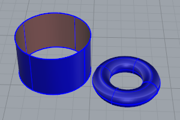

### Trimmed and untrimmed surfaces
Surfaces can be trimmed or untrimmed. A trimmed surface has two parts: a surface that underlies everything and defines the geometric shape, and trimming curves that mark sections of the underlying surface that are trimmed away.
Trimmed surfaces are created with commands that trim or split surfaces with curves and other surfaces. Some commands create trimmed surfaces directly.
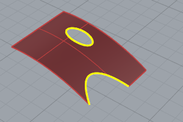
The shape of a surface is still defined by a set of [control points](controlpoint.html) arranged in a rectangular pattern.
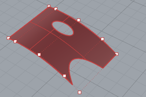
Since it can be important for you to know if a surface is trimmed, the [Properties](properties.html) command lists the trimmed or untrimmed state of the surface. Some Rhino commands work only with untrimmed surfaces and some software does not import trimmed [NURBS](http://www.rhino3d.com/nurbs) surfaces.
Trimming curves lie on the underlying surface. This surface may be larger than the trim curves, but you will not see the underlying surface because Rhino does not draw the part of the surface that is outside the trim curves. Every trimmed surface retains information about its underlying surface geometry. You can remove the trimming curve boundaries to make the surface untrimmed with the [Untrim](trim.html#untrim) command.

If you have a trim curve that runs across a surface, the trim curve itself does not have any real relationship to the [control-point](controlpoint.html) structure of the surface. You can see this if you select such a trimmed surface and turn its control points on. You will see the control points for the whole underlying surface.
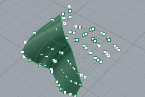
If you create a surface from a planar curve, it can be a trimmed surface. The illustrated surface was created from a circle. The [control-point](controlpoint.html) display shows the rectangular structure of the surface.
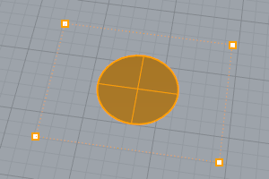
The [Untrim](trim.html#untrim) command removes the trimming curve from the surface to get back to the underlying untrimmed rectangular surface.
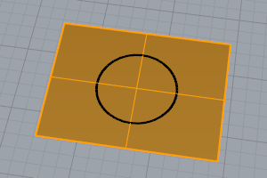

### Surface isoparametric and edge curves
In wireframe view, surfaces look like a network of crossing curves. These curves are called [isoparametric curves](isocurve.html) orisocurve. These curves help you visualize the shape of the surface. Isoparametric curves do not define the surface the way the polygons do in a polygon mesh. They are merely a visual aid that allows you to see the surface on the screen. When a surface is selected, all of its isoparametric curves highlight.
Edge curves bound the surface. Surface edge curves can be used as input to other commands.
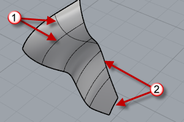
Isocurves (1), Edge curves (2).
See: [Create surfaces](sak-surface.html) 

## Polysurfaces
{: #polysurfaces}
Apolysurfaceconsists of two or more surfaces that are joined together. A polysurface that encloses a volume of space defines a solid.

Closed and open polysurfaces.
See: [Polysurfaces](sak-polysurfaces.html) 

## Solids
A solid is a surface or polysurface that encloses a volume. Solids are created anytime a surface or polysurface is completely closed. Rhino creates single-surface solids, polysurface solids, and extrusion solids.
A single surface can wrap around and join itself. Example commands include [Sphere](sphere.html), [Torus](torus.html), and [Ellipsoid](ellipsoid.html). Control points can be displayed on single-surface solids and moved to change the surface.
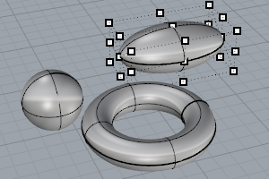
Single-surface solids.
Some Rhino commands create polysurface solids. [Pyramid](pyramid.html), [Cone](cone.html), and [TruncatedCone](truncatedcone.html) are examples of commands that create polysurface solids.
The [SolidPtOn](pointson.html#solidpton) command turns on grip points that act like control points for polysurfaces.
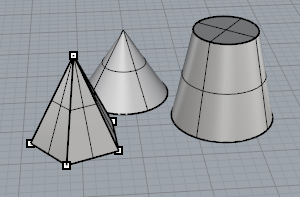
Polysurface solids.
See: [Create solid objects](sak-solid.html) 

## Light-weight extrusion objects
{: #lightweightextrusions}
Light-weight extrusion objects use only a profile curve and a length as input instead of the network of isocurves normally needed for [NURBS](http://www.rhino3d.com/nurbs) objects. The [Box](box.html), [Cylinder](cylinder.html), [Tube](tube.html), and [ExtrudeCrv](extrudecrv.html) commands create extrusion objects. Extrusion objects can be closed with a planar cap or open. These objects will be converted to polysurfaces by some commands if necessary to add additional information for editing.
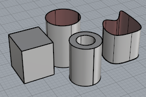
Extrusion objects.
See: [Extrude curves and surfaces](sak-extrude.html) 

## Polygon mesh objects
{: #meshes}
Because there are many modelers that use polygon meshes to represent geometry for rendering, animation, stereolithography, visualization, and finite element analysis, the [Mesh](mesh.html) command translates [NURBS](http://www.rhino3d.com/nurbs) geometry into polygonal meshes for export. In addition, the mesh creation commands [MeshSphere](meshsphere.html), [MeshBox](meshbox.html), [MeshCylinder](meshcylinder.html), etc., draw mesh objects.
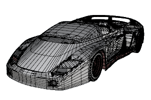
Mesh objects.
 **Note** 
There is no easy way to convert a mesh model into a [NURBS](http://www.rhino3d.com/nurbs) model. The information that defines the objects is completely different.However, Rhino has a few commands for drawing curves on meshes and extracting [vertices](meshvertex.html) and other information from mesh objects to assist in using mesh information to create [NURBS](http://www.rhino3d.com/nurbs) models.See: [Draw mesh objects](sak-mesh.html) 
&#160;
&#160;
Rhinoceros 6 © 2010-2015 Robert McNeel &amp; Associates.11-Nov-2015
 [Open topic with navigation](rhinoobjects.html) 

