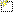

---
---

{: #kanchor2757}
# RhinoScript
 [Where can I find this command?](javascript:void(0);) Toolbars
 [Properties](properties-toolbar.html)  [Standard](standard-toolbar.html)  [Tools](tools-toolbar.html) 
Menus
Tools
Options
TheRhinoScriptoptions set script configurations.
General
Reinitialize script engine when opening new models
Specifies whetherRhinoScriptwill release all global subroutines, functions and variables from memory between modeling sessions.
Startup
Scripts to load when Rhino starts
Specifies what scripts should be loaded when Rhino starts. Scripts not listed here are loaded on demand.
New
Add a new startup script.
Delete
Deletes a script from the list.
Up
Moves a script up the list. Scripts run in the order they appear in this box.
Down
Moves a script down the list.
TheRhinoScriptcommand will not work unless the RhinoScript plug-in is loaded.
Plug-in name:RhinoScript
File:Rhinoscript.rhp
See: [Plug-ins](plug-ins.html).
To save options for use on other computers
 [OptionsExport](optionsexport.html) 
Save [Options](options.html) settings to a file.
 [OptionsImport](optionsexport.html#optionsimport) 
Restore [Options](options.html) settings from a file.
See also
 [Options](options.html) 
Manage global options: [3D mouse](3dconnexion.html), [alerter](alerter.html), [aliases](aliases.html), [appearance](appearance.html), [context menu](context-menu.html), [display modes](view-displaymode-options.html), [files](files.html), [general](general.html), [idle processor](idleprocessor.html), [keyboard](keyboard.html), [libraries](libraries.html), [licenses](licenses.html), [modeling aids](modeling-aids.html), [mouse](mouse.html), [plug-ins](plug-ins.html), [render](rendering.html), [RhinoScript](#), [selection menu](selection-menu.html), [toolbars](toolbars.html), [updates and statistics](updates-and-statistics.html), [view](view.html).
&#160;
&#160;
Rhinoceros 6 © 2010-2015 Robert McNeel &amp; Associates.11-Nov-2015
 [Open topic with navigation](rhinoscript.html) 

