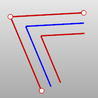
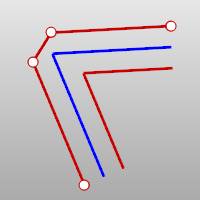

---
---

{: #kanchor1883}{: #kanchor1884}{: #kanchor1885}
# Ribbon
 [Where can I find this command?](javascript:void(0);) Toolbars
 [Extrude](extrude-toolbar.html)  [Surface Creation](surface-creation-toolbar.html)  [Surface Sidebar](surface-sidebar-toolbar.html) 
Menus
Surface
Extrude Curve
Ribbon
 [&#160;History enabled](historyenabled.html) 
The Ribbon command [Offsets](offset.html) a curve and creates a ruled surface between the two curves.
Steps
 [Select](select-objects.html) a curve.Drag the cursor to one side of the curve and pick.Your browser does not support the video tag.Command-line options
Distance
Sets the offset distance.
Loose
TheCornerandToleranceoptions are not shown and do not affect the output. Polycurves are offset as a group of separate curve segments, and there is no corner trimming or filling.
Corner
Specifies how offset corner [continuity](continuity-descriptions.html) handled. These options only apply if the offset direction is to the "outside" as shown in the image.

Original curve (blue). Offset to outside (red). Offset to inside (green).
Sharp
Curves offset to the outside of a corner will be extended to meet at sharp corners with position (G0) continuity.

Round
Curves offset to the outside of a corner will be filled with arc segments with tangent (G1) continuity.

Smooth
Curves offset to the outside of a corner will be filled with blend segments with curvature (G2) continuity.

Chamfer
The corners of the offset curves will be filled with a straight line between their endpoints.

ThroughPoint
Offsets through a picked point instead of at a distance.
Tolerance
Sets the tolerance for the offset curve.
Type 0 to use the [default system tolerance](units.html#absolutetolerance).
BothSides
Offsets the curve on both sides of the input curve.
InCPlane
The curve is offset in the plane of the original curve. This option offsets the curve in the plane of the current construction plane instead.
See also
 [Extrude curves and surfaces](sak-extrude.html) 
&#160;
&#160;
Rhinoceros 6 © 2010-2015 Robert McNeel &amp; Associates.11-Nov-2015
 [Open topic with navigation](ribbon.html) 

