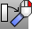

---
---

{: #kanchor1888}{: #kanchor1889}
# Rotate3D
 [Where can I find this command?](javascript:void(0);) Toolbars
 [Main2](main2-toolbar.html)  [Transform](transform-toolbar.html) 
Menus
Transform
Rotate 3-D
The Rotate3D command rotates objects around a specified axis in 3-D space.
Steps
 [Select](select-objects.html) the objects. [Pick](pick-location.html) the start of the rotation axis.Pick the end of the rotation axis.Type the angle, or pick two reference points.Your browser does not support the video tag.Command-line options
SurfaceNormal
Select a surface and then a point on the surface. The rotation axis will be defined from the point on the surface and the normal to the surface at that location.
UseLastAxis
The UseLastAxis option uses the previously selected axis direction for the rotation.
Copy
 [&#160;History enabled](historyenabled.html) 
The Copy option specifies whether or not the objects are copied. A plus signappears at the cursor when copy mode is on.
The [RememberCopyOptions](remembercopyoptions.html) command determines whether the selected option is used as the default.
See also
 [Transform objects](sak-transform.html) 
&#160;
&#160;
Rhinoceros 6 © 2010-2015 Robert McNeel &amp; Associates.11-Nov-2015
 [Open topic with navigation](rotate3d.html) 

