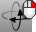
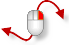
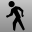

---
---

{: #kanchor1890}
# RotateCamera
 [Where can I find this command?](javascript:void(0);) Toolbars
 [Set View](set-view-toolbar.html)  [Standard](standard-toolbar.html)  [View](view-toolbar.html)  [LookAbout](lookabout-toolbar.html) 
Menus
View
 [Viewport title](rhino-window.html#viewport-title-menu) 
Set Camera
Rotate Camera
The RotateCamera command rotates the view around the camera.
Steps
 [Specify a command line option.](specifycommandlineoption.html) Your browser does not support the video tag.Command-line options
Down
Rotate the target down.
Left
Rotate the target left.
Right
Rotate the target right.
Up
Rotate the target up.
Rotate camera with the mouse in perspective views
Press [Ctrl](ctrl-key.html) and [Alt](alt-key.html) and drag with the [right mouse button](mouse-buttons.html). [Ctrl](ctrl-key.html) + [Alt](alt-key.html) +Press [Shift](shift-key.html) in addition to lock the camera rotation horizontally or vertically.+ [Shift](shift-key.html) The direction is determined by the relative location of the cursor to the point where the right mouse button was pressed down. If the cursor is more to the left or right than up or down, the rotation is locked horizontally, and vice versa.
See also
 [View options](view.html) 
Manage pan, zoom, named views rotate, dynamic redraw, viewport linking, single-click maximize, default lens length options.
 [WalkAbout](walkabout.html) 
Toggle between WalkAbout and normal navigation modes.
 [Navigate in the viewports](sak-navigate.html) 
&#160;
&#160;
Rhinoceros 6 © 2010-2015 Robert McNeel &amp; Associates.11-Nov-2015
 [Open topic with navigation](rotatecamera.html) 

