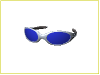
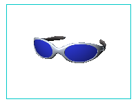
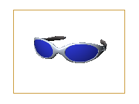

---
---

{: #kanchor1899}
# SafeFrame
 [Where can I find this command?](javascript:void(0);) Toolbars
 [Popup](popup-toolbar.html)  [Properties](properties-toolbar.html)  [Standard](standard-toolbar.html) 
Menus
Edit and Panels
Object Properties
Shortcut
F3
The Safe Frame shows the area of the viewport that will be rendered in the active viewport. If parts of the rendered view are off-screen, the safe frame will indicate this by displaying arrows either at the top and bottom or left and right. In addition, several safe-frame areas can be added to show the extent of commonly used zones in the image. The sizes of these zones can be customized.
Safe frame is useful when rendering resolution is set differently form the active viewport.
{: #safeframeproperties}Safe Frame properties
Visibility
Show safe frame in the active view
Enables and disables safe-frame display.
Show in perspective views only
By default, the safe-frame display only shows in perspective views. Clear this check box to also show the frames in parallel views.
Frames
Live area
Shows the size of the rendered view as a yellow frame in the viewport.
The live area can be controlled when rendering resolution is not set to Viewport.

Action area
Shows a user-specified action area frame in blue.
Set the percentage of the screen that will be used.

Title area
Shows a user-specified title area frame in orange.
Set the percentage of the screen that will be used.

Fields
Show 4x3 field grid
Divides the live area into a 4&#160;by&#160;3 grid, commonly used for production rendering and film work.

Command-line options
To access hidden command-line options
Type ahyphenin front of the command name:- SafeFrame.On
OnlyInPerspective
LiveArea
ActionArea
TitleArea
4x3Field
Grid
ActionParams
TitleParams
See also
 [Manage object properties](sak-objectproperties.html) 
 [Render your model scene](sak-render.html) 
&#160;
&#160;
Rhinoceros 6 © 2010-2015 Robert McNeel &amp; Associates.11-Nov-2015
 [Open topic with navigation](safeframe.html) 

