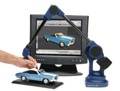

---
---

# Use a digitizing arm
Digitizing arms are used to capture point data from a physical object in order to make a 3&#8209;D virtual model of the object.

Before you start using a digitizing arm, you must initialize and calibrate the digitizer.
You can calibrate digitizers so that a coordinate system in the real world corresponds to a coordinate system in Rhino. The calibration can change in the middle of the digitizing process to allow digitizing of the underside of an object, or an object that is larger than the reach of the digitizer.
You can set the scale factor for digitized points. By default, one inch in the real world is one Rhino unit.
Digitizers use a foot pedal to pick points.
The [DigClick](digitize.html#digclick) command allows you to pick points from within Rhino. You can set up a function key (such as F12) so that when you press the function key, it is as if you pressed the foot pedal.

## Commands for connecting and setting up a digitizing arm
 [DigBeep](digitize.html#digbeep) 
Turn the digitizing arm sound on and off.
 [DigCalibrate](digitize.html#digcalibrate) 
Validate digitizer measurements against a model.
 [DigCamera](digitize.html#digcamera) 
Set the view based on the probe position and direction.
 [DigDisconnect](digitize.html#digdisconnect) 
Disconnect the digitizing arm.
 [Digitize](digitize.html) 
Connect and initialize a digitizing arm.
 [DigScale](digitize.html#digscale) 
Set a scale factor for digitized points.

## Commands for using a digitizing arm
 [DigClick](digitize.html#digclick) 
Pick a location with a digitizing arm.
 [DigLine](digitize.html#digline) 
Draw a line normal to a surface with a digitizing arm.
 [DigPause](digitize.html#digpause) 
Suspend/pause input from the digitizing arm.
 [DigSection](digitize.html#digsection) 
Create planar cross sections with a digitizing arm.
 [DigSketch](digitize.html#digsketch) 
Sketch a curve with a digitizing arm.
&#160;
&#160;
Rhinoceros 6 © 2010-2015 Robert McNeel &amp; Associates.11-Nov-2015
 [Open topic with navigation](sak-3ddigitizing.html) 

