---
---

# Analyze objects
Analyze objects for errors and repair possibilities.

## Check for errors
 [Check](check.html) 
Report errors in an object's data structure.
 [CheckNewObjects](check.html#checknewobjects) 
Report errors in an object's data structure as it is created or imported.
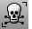 [SelBadObjects](selection-commands.html#selbadobjects) 
Select all objects that do not pass [Check](check.html).
 [ShowDir](dir.html#showdir) 
Open the Direction Analysis control and turn on direction analysis for curves, surfaces, and polysurfaces.
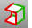 [ShowEdges](showedges.html) 
Highlight edges of surfaces and polysurfaces. Displays the Edge Analysis control.
 [ShowEnds](showends.html) 
Open the End Analysis control, and display the endpoints of curves.

## Analyze object
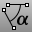 [Angle](angle.html) 
Report the angle between two picked or defined lines.
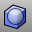 [BoundingBox](boundingbox.html) 
Creates a polyline or solid that encloses objects.
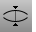 [CrvDeviation](crvdeviation.html) 
Report the maximum and minimum distances between two curves.
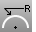 [Curvature](curvature.html) 
Evaluate the curvature of a curve or surface.
 [CurvatureGraph](curvaturegraph.html) 
Evaluate curve or surface curvature with a graph.
 [Diameter](diameter.html) 
Report the diameter of a curve at a specified point.
 [Dir](dir.html) 
Display and edit an object's normal direction.
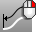 [Domain](domain.html) 
Report the domain of a curve or surface.
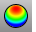 [DraftAngleAnalysis](draftangleanalysis.html) 
Visually evaluate surface draft-angle using false-color analysis.
 [DraftAnglePoint](draftanglepoint.html) 
Place a point object on a surface the surface's draft angle break location.
 [ExtractCurvatureGraph](extractcurvaturegraph.html) 
Duplicate a curve's [curvature graph](curvaturegraph.html).
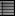 [List](list.html) 
Report information about object's data structure.
 [Radius](radius.html) 
Report the radius of a curve.
 [What](what.html) 
Report object properties details.

## Analyze surface quality
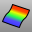 [CurvatureAnalysis](curvatureanalysis.html) 
Evaluate surface curvature using false-color analysis.
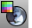 [EMap](emap.html) 
Visually evaluate surface smoothness using an image bitmap reflected in the surface.
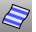 [Zebra](zebra.html) 
Visually evaluate surface smoothness and continuity using a stripe map.

## Compare objects
 [EvaluateUVPt](evaluateuvpt.html) 
Report the u and v&#160;coordinates of a specified location on a surface.
 [MarkFoci](markfoci.html) 
Place point objects at focus locations of conic curves.
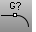 [GCon](gcon.html) 
Report the geometric continuity between two curves.
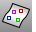 [PointDeviation](pointdeviation.html) 
Report the distance between points and a surface.
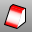 [ThicknessAnalysis](thicknessanalysis.html) 
Use false-color display to evaluate the thickness of a solid.

## Repair objects
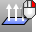 [Flip](flip.html) 
Reverse the normal direction of a curve, surface, or mesh.
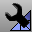 [MeshRepair](meshrepair.html) 
Open the Mesh Repair wizard.
 [Untrim](trim.html#untrim) 
Remove trim curves from trimmed surfaces.
&#160;
&#160;
Rhinoceros 6 © 2010-2015 Robert McNeel &amp; Associates.11-Nov-2015
 [Open topic with navigation](sak-analysis.html) 

