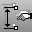

---
---

# Copy and duplicate objects
Copy and duplicate objects or parts of objects.

## Copy geometry objects and layers
 [Copy](copy.html) 
Duplicate objects.
 [CopyToLayer](layer.html#copytolayer) 
Copy objects to a layer.
 [DupLayer](duplayer.html) 
Duplicate (copy) a layer including all layer attributes and geometry.

## Copy edges and borders
 [DupBorder](dupborder.html) 
Create a curve or polyline that copies a surface, polysurface, or mesh border.
 [DupEdge](dupedge.html) 
Create a curve that copies a surface edge.
 [DupFaceBorder](dupfaceborder.html) 
Create a curve that copies a polysurface face border.
 [DupMeshEdge](dupmeshedge.html) 
Creates a polyline that duplicates the edge of a mesh.
 [DupMeshHoleBoundary](dupmeshholeboundary.html) 
Create a polyline that duplicates the boundary of a mesh hole.

## Copy layout objects
 [CopyLayout](layout.html#copylayout) 
Copy the active layout to a new layout.
 [CopyViewportToDetail](detail.html#copydetailtoviewport) 
Copy or move a model viewport to a detail viewport.
 [CopyDetailToViewport](detail.html#copydetailtoviewport) 
Copy a detail viewport to a model viewport.

## Copy settings
 [CopyCPlaneSettingsToAll](cplane.html#copycplanesettingstoall) 
Match all viewports' grid and snap settings to the specified viewport.
 [CopyCPlaneToAll](cplane.html#copycplanetoall) 
Match all viewports' construction planes to the specified viewport.
 [DupDimStyle](dupdimstyle.html) 
Create new dimension styles by copying existing styles.
&#160;
&#160;
Rhinoceros 6 © 2010-2015 Robert McNeel &amp; Associates.11-Nov-2015
 [Open topic with navigation](sak-copyandduplicate.html) 

