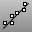
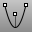

---
---

# Drawing lines and curves
A Rhino curve is similar to a piece of wire. It can be straight or wiggled, and can be open or closed.

A polycurve is several curve segments joined together end to end.{: #kanchor2270}
Rhino provides many tools for drawing curves. You can draw straight lines, polylines that consist of connected line segments, arcs, circles, polygons, ellipses, helices, and spirals.
You can also draw curves using curve control points and draw curves that pass through selected points.
See: [Wikipedia: Curve](http://en.wikipedia.org/wiki/Space_curve#Topology).

## Lines and polylines
{: #lines}
A lines is a degree 1 curve with no bends. A polyline is a series of line or arc segments joined together.
 [Line](line.html) 
Draw a single line segment.
 [LineThroughPt](linethroughpt.html) 
Fit a line through any combination of points, control points, and point-cloud objects.
 [Polyline](polyline.html) 
Draw a multi-segment polyline with options for line and arc segments, tracking line helpers, and close.
 [Polygon](polygon.html) 
Draw a polygon with a specified number of sides with options for inscribed/circumscribed, by edge, star-shaped, around a curve, and vertical.
 [Rectangle](rectangle.html) 
Draw a rectangular closed polyline from with options for starting at the center, three points, vertical, and rounded with arc or conic corners.
See: [Wikipedia: Line](http://en.wikipedia.org/wiki/Line_(geometry)).

## Free-form curves
{: #freeform}
Free-form curves in Rhino are [NURBS](http://www.rhino3d.com/nurbs) curves. A NURBS curve is defined by its order, a set of weighted control points, and a knot vector.
Rhino offers a variety of methods for creating free-form curves.
 [Catenary](catenary.html) 
Creates a curve that a hanging chain or cable assumes under its own weight when supported only at its ends.
 [Curve](curve.html) 
Draw a curve from [control point](controlpoint.html) locations.
 [HandleCurve](handlecurve.html) 
Draw chained [Bézier curves](http://en.wikipedia.org/wiki/Bézier_curve) with editing handles.
 [InterpCrv](interpcrv.html) 
Fit a curve through picked locations.
 [InterpCrvOnSrf](interpcrvonsrf.html) 
Fit a curve through locations on a surface.
 [Sketch](sketch.html) 
Drag the mouse to draw a curve.
See: [Wikipedia: Non-uniform rational B-spline](http://en.wikipedia.org/wiki/Non-uniform_rational_B-spline).

## Conic-section curves
{: #conic}
Conic-section curves were first defined as the intersection of: a right circular cone of varying vertex angle; a plane perpendicular to an element of the cone. Depending on whether the angle is less than, equal to, or greater than 90 degrees, we get ellipse, parabola, or hyperbola. An arc is a part of a circle. Rhino commands allow drawing specific conics or the general Conic command allows free-form drawing of conic curves. Conics are degree 2.

 [Conic sections: Image from A. Kursat ERBAS &amp; GooYeon Kim © 2000.](http://jwilson.coe.uga.edu/EMT668/EMAT6680.F99/Erbas/emat6690/Insunit/conicsunit.html) 
 [Conic](conic.html) 
Draw a conic section curve with options for the start, end, apex, and rho value.
 [Arc](arc.html) 
Draw an arc with options for center, start, angle, and direction.
 [Circle](circle.html) 
Draw a circle from center and radius, diameter, points on the circumference, and circumference length.
 [Ellipse](ellipse.html) 
Draw a closed elliptical curve from focus points, center and edges, bounding rectangle, and around a curve.
 [Hyperbola](hyperbola.html) 
Draw a hyperbolic curve from focus points, vertices, or coefficient.
 [Parabola](parabola.html) 
Draw a parabolic curve from focus and vertex or endpoint.
See: [Wikipedia: Conic](http://en.wikipedia.org/wiki/Conic).

## Helix and spiral
A spiral is a curve on a plane that winds around a fixed center point at a continuously increasing or decreasing distance from the point.
A helix is a three-dimensional curve that turns around an axis at a constant or continuously varying distance while moving parallel to the axis.
 [Helix](helix.html) 
Draw a helical curve with options for number of turns, pitch, vertical, reverse, and around a curve.
 [Spiral](spiral.html) 
Draw a spiral curve with options for number of turns, pitch, flat, vertical, and around a curve.
See: [Wikipedia: Spiral](http://en.wikipedia.org/wiki/Spiral).
See also
 [Create curves from other objects](sak-curvefromobject.html) 
 [Edit curves](sak-curvetools.html) 
&#160;
&#160;
Rhinoceros 6 © 2010-2015 Robert McNeel &amp; Associates.11-Nov-2015
 [Open topic with navigation](sak-curve.html) 

