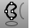
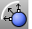
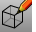

---
---

# Create curves from other objects
Use existing objects to create curves by using the objects as location references or by copying borders, edges, and outlines.

## Draw a curve through points
 [CurveThroughPolyline](curvethroughpolyline.html) 
Create a curve from polyline vertices.
 [CurveThroughPt](curvethroughpt.html) 
Fit a curve through point objects.
 [CurveThroughSrfControlPt](curvethroughsrfcontrolpt.html) 
Fit curves through surface control points.

## Blend between two curves or surfaces
 [ArcBlend](arcblend.html) 
Create an arc blend curve between two curves.
Blend
Connect two curves maintaining continuity.
 [BlendCrv](blendcrv.html) 
Connect two curves with continuity control.
 [Chamfer](chamfer.html) 
Create a line segment between two curves and trims or extends the curves to meet it.
 [Fillet](fillet.html) 
Add an arc between two curves and trims or extends the curves to the arc.

## Duplicate surface edges
 [DupBorder](dupborder.html) 
Create a curve or polyline that copies a surface, polysurface, or mesh border.
 [DupEdge](dupedge.html) 
Create a curve that copies a surface edge.
 [DupFaceBorder](dupfaceborder.html) 
Create a curve that copies a polysurface face border.
 [DupMeshEdge](dupmeshedge.html) 
Creates a polyline that duplicates the edge of a mesh.
 [DupMeshHoleBoundary](dupmeshholeboundary.html) 
Create a polyline that duplicates the boundary of a mesh hole.

## Contour and section
 [Contour](contour.html) 
Create a spaced series of planar curves and points through objects.
 [CSec](csec.html) 
Create cross-section curves through profile curves.
 [MeshOutline](meshoutline.html) 
Create a polyline outline of mesh objects or surface render mesh.
 [PointCloudSection](pointcloudsection.html) 
Create a planar curve by intersecting a plane with a point cloud.
 [Section](section.html) 
Create a planar curve or points from the intersection of a cutting plane through objects.
 [Silhouette](silhouette.html) 
Create outline curves from a surface or polysurface.

## Create curves from other curves
 [Crv2View](crv2view.html) 
Create a curve by averaging two input curves that are planar in two different views.
 [Offset](offset.html) 
Copy a curve parallel to the original.
 [OffsetCrvOnSrf](offsetcrvonsrf.html) 
Copy a curve on a surface parallel to the original.
 [OffsetNormal](offsetnormal.html) 
Copy a curve on a surface parallel to the original in the surface normal direction.
 [Project](project.html) 
Project curves/points toward a construction plane to intersect a surface.
 [Pull](pull.html) 
Pull curves/points in the surface normal direction to intersect a surface.
 [ShortPath](shortpath.html) 
Create the shortest possible curve (geodesic) between two points on a surface.

## Create curves from surfaces
 [Bounce](bounce.html) 
Shoot a ray at a collection of surfaces to create a polyline path.
 [CreateUVCrv](createuvcrv.html) 
Project a surface boundary and trim curves onto the world xy plane.
 [Intersect](intersect.html) 
Create point objects or curves at the intersections of curves and surfaces.
 [IntersectTwoSets](intersecttwosets.html) 
Find the intersection of one set of objects with another set of objects.
 [Make2D](make2d.html) 
Project geometry to the construction plane.
See also
 [Draw lines and curves](sak-curve.html) 
 [Edit curves](sak-curvetools.html) 
 [Extract object sub-elements](sak-extract.html) 
&#160;
&#160;
Rhinoceros 6 © 2010-2015 Robert McNeel &amp; Associates.11-Nov-2015
 [Open topic with navigation](sak-curvefromobject.html) 

