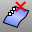
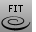
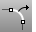
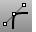
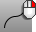

---
---

# Edit curves
Curves can be edited by changing their control-point structure.

## Turn curve points on
 [PointsOn](pointson.html) 
Display curve and surface control points.
 [PointsOff](pointson.html#pointsoff) 
Turn off [control](pointson.html), [edit](pointson.html#editpton), and [solid](pointson.html#solidpton) points display.
 [EditPtOn](pointson.html#editpton) 
Display points on the curve evaluated at [knot](knot.html) averages.
 [SolidPtOn](pointson.html#solidpton) 
Turn on pseudo control points for polysurfaces.

## Insert or remove control points
 [InsertControlPoint](insertcontrolpoint.html) 
Add control points to a curve or a row of control points to a surface.
 [InsertEditPoint](inserteditpoint.html) 
Add edit points to a curve.
 [InsertKink](insertkink.html) 
Add kinks to a curve.
 [InsertKnot](insertknot.html) 
Add knots to curves or surfaces.
 [RemoveKnot](insertknot.html#removeknot) 
Delete specified knots from a curve or surface.
 [RemoveMultiKnot](insertknot.html#removemultiknot) 
Remove multiple knots from curves and surfaces.
 [MakePeriodic](makeperiodic.html) 
Remove the kink from the start/end of a curve or surface.
 [MakeNonPeriodic](makeperiodic.html#makenonperiodic) 
Insert a kink at the start/end of a curve or surface.

## Change control point structure
 [ChangeDegree](changedegree.html) 
Change the degree of the polynomial that defines the curve or surface by adding or subtracting control points between knot spans, while maintaining the knot structure.
 [Convert](convert.html) 
Change a curve to polyline or arc segments.
 [ConvertToBeziers](convert.html#converttobeziers) 
Change the structure of a NURBS object to a Bézier object.
 [CrvSeam](crvseam.html) 
Change the seam (start/end) location on closed curves.
 [Fair](fair.html) 
Remove large curvature variations in a curve while limiting the geometry changes to the specified tolerance.
 [FitCrv](fitcrv.html) 
Make a non-rational NURBS curve of a specified degree that matches the input curve to within the specified tolerance.
 [MakeNonPeriodic](makeperiodic.html#makenonperiodic) 
Insert a kink at the start/end of a curve or surface.
 [MakePeriodic](makeperiodic.html) 
Remove the kink from the start/end of a curve or surface.
 [MakeUniform](makeuniform.html) 
Make the object knot vectors uniform without changing the control point locations.
 [MakeUniformUV](makeuniform.html#makeuniformuv) 
Make the surface knots uniform in u or v&#160;direction.
 [Rebuild](rebuild.html) 
Reconstruct curves, surfaces, and extrusion objects to a specified degree and control point number.
 [RebuildCrvNonUniform](rebuildcrvnonuniform.html) 
Interactively modify selected curves by non-uniformly re-spacing the control points.
 [RemoveMultiKnot](insertknot.html#removemultiknot) 
Remove multiple knots from curves and surfaces.
 [Reparameterize](reparameterize.html) 
Recalculate an object's parameter space to match its 3-D geometry.
 [SimplifyCrv](simplifycrv.html) 
Replace each curve segment that has the geometry of a line or an arc with a true line or arc.
 [Smooth](smooth.html) 
Average the positions of curve and surface [control points](controlpoint.html) and mesh vertices in a specified region and evens out the spacing of selected control points in small increments to remove unwanted detail, and loops in curves and surfaces.
 [Weight](weight.html) 
Edit the weight of a curve or surface control point.

## Interactive editing
These commands allow interactive curve editing.
 [FixedLengthCrvEdit](fixedlengthcrvedit.html) 
Drag points on a curve to change its shape without changing the curve's length.
 [ExtractSubCrv](extractsubcrv.html) 
Separate or duplicate polycurve segments.
 [HBar](hbar.html) 
Edit a curve or surface with Bézier curve editing handles.
 [InsertControlPoint](insertcontrolpoint.html) 
Add control points to a curve or a row of control points to a surface.
 [InsertEditPoint](inserteditpoint.html) 
Add edit points to a curve.
 [InsertKink](insertkink.html) 
Add kinks to a curve.
 [InsertKnot](insertknot.html) 
Add knots to curves or surfaces.
 [InsertLineIntoCrv](insertlineintocrv.html) 
Flatten the curve segment between picked points.
 [Match](match.html) 
Change a curve end to meet another curve or surface edge with a specified continuity.
 [MatchCrvDir](matchcrvdir.html) 
Change a curve's direction to match another curve's direction.
 [MoveUVN](moveuvn.html) 
Move curve or surface control points along the u, v, and normal directions of the object.
 [RebuildCrvNonUniform](rebuildcrvnonuniform.html) 
Interactively modify selected curves by non-uniformly re-spacing the control points.
 [RemoveKnot](insertknot.html#removeknot) 
Delete specified knots from a curve or surface.
 [SetPt](setpt.html) 
Move objects to a specified location in the x, y, and/or z&#160;directions.
 [SoftEditCrv](softeditcrv.html) 
Move the surrounding curve area smoothly relative to the distance.
 [SubCrv](subcrv.html) 
Shorten a curve to the new picked endpoints.

## Curve analysis
These commands gather information about the structure of a curve.
 [CrvDeviation](crvdeviation.html) 
Report the maximum and minimum distances between two curves.
 [CrvEnd](crvstart.html#crvend) 
Place a point object at the end of a curve.
 [CrvSeam](crvseam.html) 
Change the seam (start/end) location on closed curves.
 [CrvStart](crvstart.html) 
Place a point object at the start of a curve.
 [Curvature](curvature.html) 
Evaluate the curvature of a curve or surface.
 [CurvatureGraph](curvaturegraph.html) 
Evaluate curve or surface curvature with a graph.
 [Dir](dir.html) 
Display and edit an object's normal direction.
 [Domain](domain.html) 
Report the domain of a curve or surface.
 [EditPtOn](pointson.html#editpton) 
Display points on the curve evaluated at [knot](knot.html) averages.
 [ExtractPt](extractpt.html) 
Duplicate curve control or edit points, surface control points, and mesh vertices.
 [GCon](gcon.html) 
Report the geometric continuity between two curves.
 [Radius](radius.html) 
Report the radius of a curve.
See also
 [Edit surfaces](sak-surfacetools.html) 
&#160;
&#160;
Rhinoceros 6 © 2010-2015 Robert McNeel &amp; Associates.11-Nov-2015
 [Open topic with navigation](sak-curvetools.html) 

