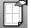
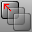

---
---

# Use drafting tools
Use tools for creating layouts with details, hatches and linetypes, and for printing.

## Set up a layout
Layouts set up your printed sheet.
 [Layout](layout.html) 
Create a print layout viewport.
 [LayoutProperties](layout.html#layoutproperties) 
Manage layout viewport properties.
 [Detail](detail.html#detail) 
Manage layout detail viewports.

## Manage object and layer visibility in layouts
 [HideInDetail](detail.html#hideindetail) 
Conceal objects in a detail view.
 [ShowInDetail](detail.html#showindetail) 
Redisplay hidden objects in a detail view.
 [ShowSelectedInDetail](detail.html#showselectedindetail) 
Redisplay selected hidden objects in a detail view.
 [ShowLayersInDetail](detail.html#showlayersindetail) 
Redisplay hidden layers in a detail view.
 [HideLayersInDetail](detail.html#hidelayersindetail) 
Conceal layers in a detail view.

## Manage hatches and linetypes
 [Hatch](hatch.html) 
Create a pattern of lines to fill bounding curves.
 [HatchBase](hatch.html#hatchbase) 
Set a starting point for existing hatches.
 [Hatch document properties](hatch.html) 
Manage the hatch settings for the current model.
 [LinetypeDisplay](linetypes.html#linetypedisplay) 
Display curves using their [linetype properties.](linetypes.html) 
 [SetLinetype](linetypes.html#setlinetype) 
Specify a curve's linetype.

## Set curve draw order
 [SendBackward](draworder.html#sendbackward) 
Send curves backward in draw order
 [SendToBack](draworder.html#sendtoback) 
Send curves to back of draw order
 [BringForward](draworder.html#bringforward) 
Bring curves forward in draw order.
 [BringToFront](draworder.html#bringtofront) 
Bring curves to the front in draw order.
 [ClearDrawOrder](draworder.html#cleardraworder) 
Return curve draw order to the default.

## Printing documents
 [RevCloud](revcloud.html) 
Draw revision cloud curves.
 [Make2D](make2d.html) 
Project geometry to the construction plane.
 [Print](print.html) 
Print the current viewport or layouts.
See also
 [ChangeSpace](changespace.html) 
Change the "space" of object from layout to detail and vise versa.
 [Use text and dimensions for annotation](sak-textanddimensions.html) 
&#160;
&#160;
Rhinoceros 6 © 2010-2015 Robert McNeel &amp; Associates.11-Nov-2015
 [Open topic with navigation](sak-drafting.html) 

