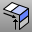

---
---

# Extend curves and surfaces

## Extend curves
 [Extend](extend.html) 
Lengthen a curve.
 [ExtendCrvOnSrf](extendcrvonsrf.html) 
Lengthen a curve on a surface to the surface edges.
 [Connect](connect.html) 
Extend and trim curves to meet at their endpoints.
 [ContinueCurve](continuecurve.html) 
Continue to draw the selected curve using control points.
 [ContinueInterpCrv](continuecurve.html#continueinterpcrv) 
Continue to draw the selected curve interpolating through picked points.

## Extend surfaces
 [ExtendSrf](extendsrf.html) 
Lengthen a surface by a value.
 [ConnectSrf](connectsrf.html) 
Extend surface edges to meet and trims the surfaces to each other.
See also
 [Edit curves](sak-curvetools.html) 
 [Edit surfaces](sak-surfacetools.html) 
&#160;
&#160;
Rhinoceros 6 © 2010-2015 Robert McNeel &amp; Associates.11-Nov-2015
 [Open topic with navigation](sak-extend.html) 

