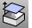
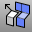

---
---

# Extract object sub-elements
The commands that extract parts of objects can be used to
Create curves based on the geometry of the object.Open a hole or to separate a badly constructed surface from a polysurface in order to repair it.Separate the render or analysis mesh from an object in order to use the mesh for a different purpose such as rapid prototyping or rendering.Remove mesh faces in order to repair problems with a mesh.
## Extract curves from a surface or polysurface
 [ExtractControlPolygon](extractcontrolpolygon.html) 
Fit a polyline through curve control points or a mesh through surface control points.
 [ExtractCurvatureGraph](extractcurvaturegraph.html) 
Duplicate a curve's [curvature graph](curvaturegraph.html).
 [ExtractIsocurve](extractisocurve.html) 
Duplicate surface [isoparametric curves](isocurve.html).
 [ExtractPt](extractpt.html) 
Duplicate curve control or edit points, surface control points, and mesh vertices.
 [ExtractSubCrv](extractsubcrv.html) 
Separate or duplicate polycurve segments.
 [ExtractWireframe](extractwireframe.html) 
Duplicate surface or polysurface edge and [isoparametric curves](isocurve.html).

## Extract surfaces from a polysurface
 [ExtractBadSrf](extractbadsrf.html) 
Separate surfaces with errors from a polysurface.
 [ExtractSrf](extractsrf.html) 
Separate or duplicate a polysurface face.

## Extract mesh faces and edges
 [ExtractConnectedMeshFaces](extractmeshfaces-commands.html#extractconnectedmeshfaces) 
Separate mesh faces connected to a face.
 [ExtractDuplicateMeshFaces](extractmeshfaces-commands.html#extractduplicatemeshfaces) 
Separate duplicated faces from a mesh.
 [ExtractMeshEdges](extractmeshedges.html) 
Separate faces from the parent mesh determined by a draft angle or weld status.
 [ExtractMeshFaces](extractmeshfaces-commands.html) 
Separate faces from a mesh.
 [ExtractMeshFacesByArea](extractmeshfaces-commands.html#extractmeshfacesbyarea) 
Separate faces from a mesh by area.
 [ExtractMeshFacesByAspectRatio](extractmeshfaces-commands.html#extractmeshfacesbyaspectratio) 
Separate faces from a mesh by aspect ratio.
 [ExtractMeshFacesByDraftAngle](extractmeshfaces-commands.html#extractmeshfacesbydraftangle) 
Separate faces from a mesh by a draft angle or weld status.
 [ExtractMeshFacesByEdgeLength](extractmeshfaces-commands.html#extractmeshfacesbyedgelength) 
Separate faces from a mesh by edge length.
 [ExtractMeshPart](extractmeshfaces-commands.html#extractmeshpart) 
Separate faces from a mesh that are bounded by unwelded edges.
 [ExtractNonManifoldMeshEdges](extractmeshedges.html#extractnonmanifoldmeshedges) 
Separate non-manifold faces from a mesh.

## Extract object meshes
 [ExtractAnalysisMesh](extractanalysismesh.html) 
Duplicate an object's [analysis](curvatureanalysis.html) mesh.
 [ExtractPipedCurve](extractpipedcurve.html) 
Duplicate a curve's [piping](curvepiping.html) mesh.
 [ExtractRenderMesh](extractrendermesh.html) 
Duplicate the [render](render.html) mesh.
 [ExtractUVMesh](texturemapping.html#extractuvmesh) 
Duplicate the uv mesh.
See also
 [Edit curves](sak-curvetools.html) 
 [Collapse mesh faces and vertices](sak-collapsemesh.html) 
 [Edit surfaces](sak-surfacetools.html) 
 [White paper: Scan, Cleanup, Remodel](http://download.rhino3d.com/download.asp?id=ScanCleanupRemodel) 
&#160;
&#160;
Rhinoceros 6 © 2010-2015 Robert McNeel &amp; Associates.11-Nov-2015
 [Open topic with navigation](sak-extract.html) 

