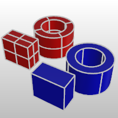
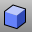
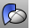
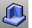
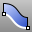

---
---

{: #kanchor2289}{: #kanchor2290}{: #kanchor2291}{: #kanchor2292}{: #kanchor2293}
# Extrude curves and surfaces
Extrudes use a base curve or surface to make an open or closed shape. Extrusions can be polysurfaces or lightweight extrusion objects.

Polysurfaces (red); extrusion objects (blue).

## Lightweight extrusion objects
Light-weight extrusion objects use only a profile curve and a length as input instead of the network of isocurves normally needed for [NURBS](http://www.rhino3d.com/nurbs) objects. The [Box](box.html), [Cylinder](cylinder.html), [Tube](tube.html), [ExtrudeCrv](extrudecrv.html), and [ExtrudeSrf](extrudesrf.html) commands create extrusion objects. Extrusion objects can be closed with a planar cap or open. These objects will be converted to polysurfaces by some commands if necessary to add additional information for editing.
Lightweight extrusion objects use less memory, mesh faster, and save smaller than the traditional polysurfaces.
In models containing large numbers of extrusions represented by traditional polysurfaces, performance can be sluggish due to the relatively high demand on resources. If the same objects are made in Rhino as lightweight extrusion objects, these models are more responsive and more memory is available.
The [UseExtrusions](useextrusions.html) command controls the use of lightweight extrusion objects. To make commands that normally create extrusions create traditional polysurfaces, select thePolysurfaceoption.
Commands affected
 [UseExtrusions](useextrusions.html) 
Specifies whether extrusion objects or polysurfaces are used when extruding straight&#8209;side objects.
The [UseExtrusions](useextrusions.html) command controls the use of extrusion objects.
When [UseExtrusions](useextrusions.html) is turned on, Rhino commands that create simple solids and surfaces will use extrusion objects when possible.When [UseExtrusions](useextrusions.html) is turned off, Rhino will use surface and polysurface objects.Turning off [UseExtrusions](useextrusions.html) does not change existing extrusion objects. [ConvertExtrusion](convertextrusion.html) 
Convert extrusion objects to surfaces and polysurfaces.
 [SelExtrusion](selection-commands.html#selextrusion) 
Select object by its object ID number.
The [SelExtrusion](selection-commands.html#selextrusion) command will not select polysurface or surface objects. Use this command if you want to see which objects are extrusion objects.
 [SelExtrusion](selection-commands.html#selextrusion) 
Select object by its object ID number.
 [Explode](explode.html) 
Break objects down into components.
Exploding an extrusion object results in an exploded a polysurface.
 [Mesh](mesh.html) 
Create a mesh from a NURBS surface or polysurface.
The walls of extrusion objects are always meshed with quadrangles running the length of the extrusion. The caps are generally meshed with triangles.
 [SaveAs](save.html#saveas) 
Save the current model with a different name, close the current model, and open the new model.
Extrusion objects are converted to polysurfaces when saving as Rhino 4 or earlier.
 [ConvertExtrusion](convertextrusion.html) 
Convert extrusion objects to surfaces and polysurfaces.

## Extrude curves
 [ExtrudeCrv](extrudecrv.html) 
Drive closed planar curves in a straight line.
 [ExtrudeCrvAlongCrv](extrudecrvalongcrv.html) 
Drive closed planar curves along a path curve.
 [ExtrudeCrvTapered](extrudecrvtapered.html) 
Drive closed planar curves in a straight line tapering at an angle.
 [ExtrudeCrvToPoint](extrudecrvtopoint.html) 
Drive closed planar curves tapering to a point.

## Extrude surfaces
 [ExtrudeSrf](extrudesrf.html) 
Drive surface edges in a straight line to create a solid.
 [ExtrudeSrfAlongCrv](extrudesrfalongcrv.html) 
Drive surface edges along a path curve to create a solid.
 [ExtrudeSrfTapered](extrudesrftapered.html) 
Drive surface edges in a straight line tapering at an angle to create a solid.
 [ExtrudeSrfToPoint](extrudesrftopoint.html) 
Drive surface edges tapering to a point to create a solid.

## Draw extrusions
 [Box](box.html) 
Draws a solid box.
 [Cylinder](cylinder.html) 
Draw a cylinder.
 [Pipe](pipe.html) 
Create a [surface](rhinoobjects.html#surfaces), [polysurface](rhinoobjects.html#polysurfaces), or [extrusion](rhinoobjects.html#lightweightextrusions) object with a circular profile around a curve.
 [Slab](slab.html) 
Offset a polyline, and extrude and cap the result to create a solid.

## Special case extrusions
 [Boss](boss.html) 
Extrude closed planar curves normal to the curve plane toward a boundary surface where the boundary surface is trimmed and joined to the extruded objects.
 [Fin](fin.html) 
Extrude a curve on a surface in the surface normal direction.
 [Pipe](pipe.html) 
Create a [surface](rhinoobjects.html#surfaces), [polysurface](rhinoobjects.html#polysurfaces), or [extrusion](rhinoobjects.html#lightweightextrusions) object with a circular profile around a curve.
 [Rib](rib.html) 
Extrude a curve in two directions to a boundary surface.
 [Ribbon](ribbon.html) 
Offset a curve and create a ruled surface between the curves.
 [Slab](slab.html) 
Offset a polyline, and extrude and cap the result to create a solid.
See also
 [Polysurfaces](sak-polysurfaces.html) 
&#160;
&#160;
Rhinoceros 6 © 2010-2015 Robert McNeel &amp; Associates.11-Nov-2015
 [Open topic with navigation](sak-extrude.html) 

