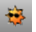

---
---

# Add lights
Add lights and lighting effects for [rendering](sak-render.html).

## Create lights
 [EditLightByHighlight](editlightbyhighlight.html) 
Add lights based on highlight locations.
 [DirectionalLight](directionallight.html) 
Insert a light with parallel rays pointing in a direction.
 [LinearLight](linearlight.html) 
Insert a tubular light.
 [PointLight](pointlight.html) 
Insert an omni-directional light.
 [RectangularLight](rectangularlight.html) 
Insert a rectangular directional light.
 [Spotlight](spotlight.html) 
Insert a light cone object.
 [Sun](sun.html) 
Open the Sun panel.

## Edit lights
 [Light properties](light.html) 
Manage color, on/off, shadow intensity, spotlight hardness.
 [EditLightByLooking](editlightbylooking.html) 
Set a spotlight direction using view manipulation tools.
 [SetSpotlightToView](setspotlighttoview.html) 
Match spotlight direction to the viewport camera direction.
See also
 [SetViewToSpotlight](setviewtospotlight.html) 
Match the view to a spotlight direction.
 [Render](render.html) 
Render the objects using the current renderer.
 [Rhino Render Document Properties](rhino-render.html) 
&#160;
&#160;
Rhinoceros 6 © 2010-2015 Robert McNeel &amp; Associates.11-Nov-2015
 [Open topic with navigation](sak-lights.html) 

