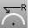

---
---

# Measure
Measure real or imaginary distances.

## Measure objects
Measure length, radius, area, and volume.
 [Area](area.html) 
Report an object's area.
 [Length](length.html) 
Report the length of curves or surface edges.
 [Radius](radius.html) 
Report the radius of a curve.
 [CutVolume](cutvolume.html) 
Report the volume of the intersection of a solid and a box.
 [Volume](volume.html) 
Report the volume of closed surfaces, polysurfaces, or meshes.

## Measure screen input
Measure by picking points on the screen.
 [Angle](angle.html) 
Report the angle between two picked or defined lines.
 [Distance](distance.html) 
Report the distance between two picked locations.
 [EvaluatePt](evaluatept.html) 
Report the world and construction plane coordinates of a picked location.

## On-screen calculators
 [Calc](calc.html) 
Toggle the on-screen calculator.
 [CalcRPN](calc.html#calcrpn) 
Toggle the on-screen RPN (reverse Polish notation) calculator.
See also
 [Text and dimensions](sak-textanddimensions.html) 
 [Analyze an object's mass properties](sak-massproperties.html) 
&#160;
&#160;
Rhinoceros 6 © 2010-2015 Robert McNeel &amp; Associates.11-Nov-2015
 [Open topic with navigation](sak-measure.html) 

