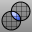
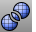
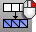

---
---

# Edit mesh objects
Edit existing mesh objects.

## Edit meshes
 [DeleteMeshFaces](deletemeshfaces.html) 
Remove mesh faces from a mesh creating a hole.
 [FillMeshHole](fillmeshhole.html) 
Fill a hole in a mesh.
 [FillMeshHoles](fillmeshholes.html) 
Fill all holes in a mesh.
 [Merge2MeshFaces](merge2meshfaces.html) 
Merge two triangular mesh faces into one quadrangular face.
 [MeshBooleanDifference](meshbooleandifference.html) 
Subtract the volume of one set of objects from another resulting in a mesh.
 [MeshBooleanIntersection](meshbooleanintersection.html) 
Create a new mesh from the intersected volumes of objects.
 [MeshBooleanSplit](meshbooleansplit.html) 
Split and close objects at intersections.
 [MeshBooleanUnion](meshbooleanunion.html) 
Combine the volumes of objects into a single mesh.
 [MeshIntersect](meshintersect.html) 
Create a polyline at the intersection of mesh objects.
 [MeshSplit](meshsplit.html) 
Divide meshes into parts with another object.
 [MeshTrim](meshtrim.html) 
Delete portions of a mesh inside or outside intersections with another object.
 [NgonulateMesh](ngonulatemesh.html) 
Creates ngons from regions of connected coplanar welded faces.
 [OffsetMesh](offsetmesh.html) 
Copy a mesh parallel to the original.
 [PatchSingleFace](patchsingleface.html) 
Fill a mesh hole with a single mesh face.
 [SplitMeshWithCurve](splitmeshwithcurve.html) 
Divide a mesh with a curve.
 [Weld](weld.html) 
Remove creases from a mesh by merging coincident mesh vertices.
 [Unweld](weld.html#unweld) 
Add creases to a smooth mesh by creating coincident vertices.
 [WeldEdge](weld.html#weldedge) 
Remove creases from a mesh by merging coincident mesh vertices along selected edges.
 [UnweldEdge](weld.html#unweldedge) 
Add creases to a smooth mesh by creating coincident vertices along selected edges.
 [WeldVertices](weld.html#weldvertices) 
Remove creases from a mesh by merging all selected mesh vertices.

## Fix mesh errors
 [AlignMeshVertices](alignmeshvertices.html) 
Force mesh vertices to the same location.
 [CullDegenerateMeshFaces](culldegeneratemeshfaces.html) 
Delete zero-area mesh faces.
 [MatchMeshEdge](matchmeshedge.html) 
Move naked mesh face edges to meet adjacent face edges.
 [MeshRepair](meshrepair.html) 
Open the Mesh Repair wizard.
 [RebuildMesh](rebuildmesh.html) 
Strip texture coordinates, [vertex](meshvertex.html) colors, surface curvatures, and surface parameters from a mesh.
 [RebuildMeshNormals](rebuildmeshnormals.html) 
Remove mesh normals and reconstruct the face and [vertex](meshvertex.html) normals.
 [SwapMeshEdge](swapmeshedge.html) 
Transpose the corners of mesh triangles.
 [UnifyMeshNormals](unifymeshnormals.html) 
Change the normal direction mesh faces so they all point in a consistent direction.

## Change mesh structure
 [PolygonCount](polygoncount.html) 
Report the number of mesh polygons in a selected object.
 [QuadrangulateMesh](quadrangulatemesh.html) 
Merge mesh triangles into quadrangles.
 [ReduceMesh](reducemesh.html) 
Reduce the number of mesh polygons and triangulates quadrangles.
 [TriangulateMesh](triangulatemesh.html) 
Split each quadrangular mesh face into two triangles.
 [TriangulateNonPlanarQuads](triangulatenonplanarquads.html) 
Split each non-planar quadrangular mesh face into two triangles.
 [TriangulateRenderMeshes](triangulaterendermeshes.html) 
Split each quadrangular polygon render mesh face into two triangles.

## Ngon related
 [NgonulateMesh](ngonulatemesh.html) 
Creates ngons from regions of connected coplanar welded faces.
 [DeleteMeshNgons](ngonulatemesh.html#deletemeshngons) 
Removes ngon groups from a mesh.
See also
 [Mesh](mesh.html) 
Create a mesh from a NURBS surface or polysurface.
 [White paper: Scan, Cleanup, Remodel](http://download.rhino3d.com/download.asp?id=ScanCleanupRemodel) 
 [Collapse mesh faces and vertices](sak-collapsemesh.html) 
&#160;
&#160;
Rhinoceros 6 © 2010-2015 Robert McNeel &amp; Associates.11-Nov-2015
 [Open topic with navigation](sak-meshtools.html) 

