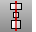

---
---

# Move objects
Commands for moving objects.

## General object moving
 [Align](align.html) 
Line up bounding boxes of objects.
 [Distribute](distribute.html) 
Spread objects out evenly between the end objects.
 [Gumball](gumball.html) 
Displays the gumball widget on a selected object facilitating move, scale, and rotate transformations around the gumball origin.
 [Move](move.html) 
Move objects from one location to another.
 [MoveUVN](moveuvn.html) 
Move curve or surface control points along the u, v, and normal directions of the object.
 [NamedPosition](namedposition.html) 
Save and restore the location of objects.
 [Nudge](modeling-aids-nudge.html) 
Move objects a small increment using arrow keys.
 [SoftMove](softmove.html) 
Move objects relative to a center with falloff.

## Specialized object moves
 [MoveCrv](movecrv.html) 
Move a polycurve/polyline segment.
 [MoveFace](moveface.html) 
Move a polysurface face.
 [MoveHole](movehole.html) 
Move or copy a hole in a planar surface.
 [MoveUntrimmedEdge](moveuntrimmededge.html) 
Move the edge of an untrimmed polysurface face.
 [MoveUntrimmedFace](moveuntrimmedface.html) 
Move an untrimmed polysurface face.
&#160;
&#160;
Rhinoceros 6 © 2010-2015 Robert McNeel &amp; Associates.11-Nov-2015
 [Open topic with navigation](sak-move.html) 

