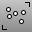

---
---

# Edit objects using control points
Turn on object points and change the location of the points with [Drag](move.html#drag), [Move](move.html), [Nudge](move.html#nudge), [MoveUVN](moveuvn.html), [Gumball](gumball.html), [Scale](scale.html), [Rotate](rotate.html), [Bend](bend.html), or other [transform](sak-transform.html) commands or [universal deformation](sak-udt.html) tools.

## Display control points for curves, surfaces, and polysurfaces
 [EditPtOn](pointson.html#editpton) 
Display points on the curve evaluated at [knot](knot.html) averages.
 [PointsOff](pointson.html#pointsoff) 
Turn off [control](pointson.html), [edit](pointson.html#editpton), and [solid](pointson.html#solidpton) points display.
 [PointsOn](pointson.html) 
Display curve and surface control points.
 [PtOffSelected](pointson.html#ptoffselected) 
Turn off control and edit points for selected objects.
 [SolidPtOn](pointson.html#solidpton) 
Turn on pseudo control points for polysurfaces.

## Select points
 [SelPt](selection-commands.html#selpt) 
Select all [point](point.html) objects, [control points](pointson.html), [edit points](pointson.html#editpton), and [solid points](pointson.html#solidpton).
 [AddNextU](selection-commands.html#addnextu) 
Add the next control point in the u&#160;direction to the selection.
 [AddNextV](selection-commands.html#addnextv) 
Add the next control point in the v&#160;direction to the selection.
 [AddPrevU](selection-commands.html#addprevu) 
Add the previous control point in the u&#160;direction to the selection.
 [AddPrevV](selection-commands.html#addprevv) 
Add the previous control point in the v&#160;direction to the selection.
 [NextU](selection-commands.html#nextu) 
Select the control point in the positive u&#160;direction.
 [NextV](selection-commands.html#nextv) 
Select the control point in the positive v&#160;direction.
 [PrevU](selection-commands.html#prevu) 
Select the control point in the negative u&#160;direction.
 [PrevV](selection-commands.html#prevv) 
Select the control point in the negative v&#160;direction.
 [SelConnected](selection-commands.html#selconnected) 
Select adjacent control points.
 [SelU](selection-commands.html#selu) 
Select all connected control points in the u&#160;direction.
 [SelUV](selection-commands.html#seluv) 
Select connected control points in the u and v&#160;directions.
 [SelV](selection-commands.html#selv) 
Select all connected control points in v&#160;direction.
&#160;
&#160;
Rhinoceros 6 © 2010-2015 Robert McNeel &amp; Associates.11-Nov-2015
 [Open topic with navigation](sak-pointediting.html) 

