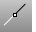
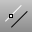
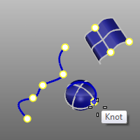
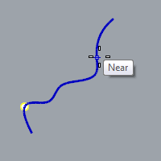
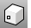
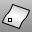
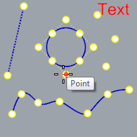
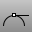

---
---

# Model with precision
Constrain cursor movement
 [To Cartesian coordinates](cursor-constraints.html#coordinate-entry). [ [To an angle.](cursor-constraints.html#coordinate-entry) ](cursor-constraints.html#angle)  [To a distance from the last point.](cursor-constraints.html#distance-constraint)  [To both an angle and a distance.](cursor-constraints.html#distance-and-angle-constraint-used-together)  [Vertically from the construction plane.](cursor-constraints.html#elevator-mode)  [To x, y, and z&#160;coordinate points.](cursor-constraints.html#point-filters)  [To relative coordinates.](cursor-constraints.html#relative-coordinates) 
## Snap to the cursor to a specific location on an object
 [Object snaps](object-snaps.html) 
Constrain the marker to an exact location on an object such as the center of a circle or the midpoint of a line.
 [Osnap](object-snaps.html#osnap) 
Set object snaps state.
 [AlongLine object snap](object-snaps.html#osnap-alongline) 
Track along a line.
 [AlongParallel object snap](object-snaps.html#osnap-alongparallel) 
Track along a line parallel to a reference line between two points.
 [Between object snap](object-snaps.html#osnap-between) 
Snap midway between two specified locations.
 [Center object snap](object-snaps.html#osnap-center) 
Snap to the center of a circle, arc, closed polyline, or annotation text bounding box.
 [End object snap](object-snaps.html#osnap-end) 
Snap to the end of a curve.
 [From object snap](object-snaps.html#osnap-from) 
Snap from a specified base point.
 [Intersection object snap](object-snaps.html#osnap-intersection) 
Snap to the intersections of curves, edges, and [isoparametric curves](isocurve.html) on a surface.
 [Knot object snap](object-snaps.html#osnap-knot) 
Snap to a knot on a curve or surface.
 [Midpoint object snap](object-snaps.html#osnap-midpoint) 
Snap to the midpoint of a curve or surface edge.
 [Near object snap](object-snaps.html#osnap-near) 
Snap onto a curve at the cursor location.
 [NoSnap object snap](object-snaps.html#osnap-nosnap) 
Turn off persistent object snaps for one pick.
 [OnCrv object snap](object-snaps.html#osnap-oncrv) 
Snap to and track along a selected curve for one pick.
 [OnPolysurface object snap](object-snaps.html#osnap-onpolysrf) 
Snap to and track over a polysurface for one pick.
 [OnSurface object snap](object-snaps.html#osnap-onsrf) 
Snap to and track over a surface for one pick.
 [Perpendicular (To) object snap](object-snaps.html#osnap-perp) 
Snap perpendicular to a curve.
 [PerpendicularFrom object snap](object-snaps.html#osnap-perpendicularfrom) 
Track along a line perpendicular to a curve.
 [Point object snap](object-snaps.html#osnap-point) 
Snap to a [point object](points.html), [control point](controlpoint.html), [edit point](pointson.html#editpton), and [block](block.html) or [text](text.html) insertion point.
 [Quadrant object snap](object-snaps.html#osnap-quad) 
Snap to the point on a curve that is at the maximum x or y point relative to the current construction plane.
 [Tangent (To) object snap](object-snaps.html#osnap-tan) 
Snap tangent to a curve.
 [TangentFrom object snap](object-snaps.html#osnap-tangentfrom) 
Track along a line tangent to a curve.
 [Vertex object snap](object-snaps.html#osnap-vertex) 
Snap to a mesh [vertex](meshvertex.html).
See also
 [Set model units](unit-systems.html) 
 [Pick a location](pick-location.html) 
&#160;
&#160;
Rhinoceros 6 © 2010-2015 Robert McNeel &amp; Associates.11-Nov-2015
 [Open topic with navigation](sak-precisionmodeling.html) 

