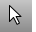
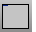
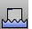
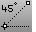

---
---

# Use scripting
Scripting extends Rhino functionality.
All Rhino commands can be used in command macros. Command macros can be run by typing the command at the command prompt, from toolbar buttons, [shortcut keys](keyboard.html), [command aliases](aliases.html), from the [ReadCommandFile](rhinoscripting.html#readcommandfile) command, or using the [Paste](paste.html) command into Rhino's command stream.
Some commands are provided to facilitate scripting actions usually performed through the Rhino interface.

# Specialized commands for scripting

## Action
 [Cancel](cancel.html) 
Cancel the current command and deselects objects.
 [Delete](delete.html) 
Erase objects.
 [Echo](rhinoscripting.html#echo) 
Turn on echoing of script commands to the command history window.
 [EditPythonScript](rhinoscripting.html#editpythonscript) 
Edit a Python script.
 [EditScript](rhinoscripting.html#editscript) 
Open a text editor utility for editing RhinoScript files.
 [Enter](rhinoscripting.html#enter) 
Simulate the Enter key in a script.
 [EnterEnd](rhinoscripting.html#enterend) 
Simulate the Enter key to complete a command string in a script.
 [GetDocumentUserText](rhinoscripting.html#getdocumentusertext) 
Retrieve text information attached to a file with the [SetDocumentUserText](rhinoscripting.html#setdocumentusertext) command.
 [GetUserText](rhinoscripting.html#getusertext) 
Retrieve text information attached to an object using the [SetUserText](rhinoscripting.html#setusertext) command.
 [MacroEditor](rhinoscripting.html#macroeditor) 
Open an edit window for script creation and testing.
 [NoEcho](rhinoscripting.html#noecho) 
Turn off echoing of script commands to the command history window.
 [Pause](rhinoscripting.html#pause) 
Stop a script for user input.
 [ReadCommandFile](rhinoscripting.html#readcommandfile) 
Read and execute a command script from a text file.
 [Run](rhinoscripting.html#run) 
Run another application from inside Rhino.
 [RunPythonScript](rhinoscripting.html#runpythonscript) 
Run a Python script.
 [RunScript](rhinoscripting.html#runscript) 
Run a RhinoScript.
 [SetCurrentRenderPlugIn](render.html#setcurrentrenderplugin) 
Specify a rendering plug-in.
 [SetDisplayMode](setdisplaymode.html) 
Specify a viewport display mode.
 [SetDocumentUserText](rhinoscripting.html#setdocumentusertext) 
Attach text information to the file.
 [SetObjectName](setobjectname.html) 
Assign a name to an object.
 [SetRedrawOff](rhinoscripting.html#setredrawoff) 
Disable screen redraw, construction plane, and view changes during scripts.
 [SetRedrawOn](rhinoscripting.html#setredrawon) 
Enable screen redraw, construction plane, and view changes during scripts.
 [SetUserText](rhinoscripting.html#setusertext) 
Attach text information to an object.
 [SetWorkingFolder](setworkingfolder.html) 
Specify the default folder for saving and opening files.

## Interface
 [BringViewportToTop](viewport-arrangement.html#bringviewporttotop) 
Bring a viewport to the front.
 [ClearUndo](clearundo.html) 
Clear the undo buffer to free memory.
 [CloseRenderWindow](render.html#closerenderwindow) 
Close the render display window.
 [CloseViewport](new-viewport-arrangements.html#closeviewport) 
Close the active viewport.
 [CommandPrompt](commandprompt.html) 
Manage the display of the command prompt window.
 [CopyRenderWindowToClipboard](render.html#copyrenderwindowtoclipboard) 
Copy the image in the render window to the Clipboard.
 [DocumentPropertiesPage](documentpropertiespage.html) 
Open the Document Properties dialog box at the specified page.
 [Exit](rhinoscripting.html#exit) 
Close Rhino.
 [Maximize](sizeapplicationwindow-commands.html#maximize) 
Maximize the Rhino application window.
 [MaxViewport](maxviewport.html) 
Maximize the active viewport.
 [NewFloatingViewport](new-viewport-arrangements.html#newfloatingviewport) 
Create a new free-floating viewport.
 [NewViewport](new-viewport-arrangements.html#newviewport) 
Create a new viewport.
 [NextOrthoViewport](nextviewport.html#nextorthoviewport) 
Activate the next viewport with an orthogonal projection.
 [NextPerspectiveViewport](nextviewport.html#nextperspectiveviewport) 
Activate the next viewport with a perspective projection.
 [NextViewport](nextviewport.html) 
Activate the next viewport.
 [NextViewportToTop](viewport-arrangement.html#nextviewporttotop) 
Display the next viewport in front of all other viewports.
 [Ortho](ortho.html) 
Restrict cursor movement to an angle.
 [OrthoAngle](ortho.html#orthoangle) 
Set the angle for cursor ortho movement.
 [OptionsPage](optionspage.html) 
Open the Options dialog box at a specified page.
 [PrevViewport](nextviewport.html#prevviewport) 
Activate the previous viewport.
 [PushViewportToBack](viewport-arrangement.html#pushviewporttoback) 
Send a named viewport behind all viewports.
 [PropertiesPage](propertiespage.html) 
Open the Properties dialog box at a specified page.
 [SetActiveViewport](setactiveviewport.html) 
Activate a named viewport.
 [SetMaximizedViewport](setmaximizedviewport.html) 
Maximize a named viewport inside the application window.
 [SetOrtho](ortho.html#setortho) 
Turn ortho mode on, off, or toggle the current state.
 [SetPlanar](planar.html#setplanar) 
Turn Planar mode on, off, or toggle the current state.
 [SetSnap](snap.html#setsnap) 
Turn grid snap on, off, or toggle the current state.
 [ShowOsnap](object-snaps.html#showosnap) 
Turn the Osnap control on.
 [Snap](snap.html) 
Toggle the current snap mode state.
 [SnapSize](snap.html#snapsize) 
Specify the grid snap spacing.

## Import/Export
 [AssignBlankTexture](assignblanktexture.html) 
Assign texture names to objects.
 [ComputeVertexColors](computevertexcolors.html) 
Evaluate texture coordinates and set [vertex](meshvertex.html) colors.
See also
 [Command Macros and Scripting](rhinoscripting.html) 
&#160;
&#160;
Rhinoceros 6 © 2010-2015 Robert McNeel &amp; Associates.11-Nov-2015
 [Open topic with navigation](sak-scripting.html) 

