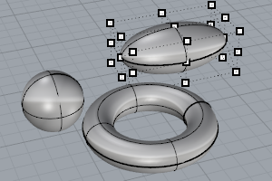
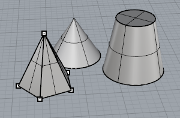

---
---

# Solid objects
A solid is a surface or polysurface that encloses a volume. Solids are created anytime a surface or polysurface is completely closed. Rhino creates single-surface solids, polysurface solids, and extrusion solids.

## Draw single surface solids
A single surface can wrap around and join itself. Example commands include [Sphere](sphere.html), [Torus](torus.html), and [Ellipsoid](ellipsoid.html). Control points can be displayed on single-surface solids and moved to change the surface.

 [Ellipsoid](ellipsoid.html) 
Draw a solid ellipsoid.
 [Sphere](sphere.html) 
Draw a solid sphere.
 [Torus](torus.html) 
Draw a torus (donut shape).

## Draw polysurface solids
Some Rhino commands create polysurface solids. Apolysurfaceconsists of two or more surfaces that are joined together. A polysurface that encloses a volume of space defines a solid. [Pyramid](pyramid.html), [Cone](cone.html), and TCone are examples of commands that create polysurface solids.

The [SolidPtOn](pointson.html#solidpton) command turns on grip points for polysurfaces, which act like control points.
 [Box](box.html) 
Draws a solid box.
 [Cone](cone.html) 
Draw a cone.
 [Cylinder](cylinder.html) 
Draw a cylinder.
 [Paraboloid](paraboloid.html) 
Draw a parabolic surface or capped solid.
 [Pyramid](pyramid.html) 
Draw a pyramid.
 [TruncatedCone](truncatedcone.html) 
Draw a cone whose apex is truncated by a plane.
 [TruncatedPyramid](truncatedpyramid.html) 
Draw a pyramid whose apex is truncated by a plane.
 [Tube](tube.html) 
Draw a closed cylinder with a concentric cylindrical hole.

## Create solid object from curves or surfaces
 [Boss](boss.html) 
Extrude closed planar curves normal to the curve plane toward a boundary surface where the boundary surface is trimmed and joined to the extruded objects.
 [ExtrudeCrv](extrudecrv.html) 
Drive closed planar curves in a straight line.
 [ExtrudeSrf](extrudesrf.html) 
Drive surface edges in a straight line to create a solid.
 [Pipe](pipe.html) 
Create a [surface](rhinoobjects.html#surfaces), [polysurface](rhinoobjects.html#polysurfaces), or [extrusion](rhinoobjects.html#lightweightextrusions) object with a circular profile around a curve.
 [Rib](rib.html) 
Extrude a curve in two directions to a boundary surface.
 [Slab](slab.html) 
Offset a polyline, and extrude and cap the result to create a solid.
See also
 [Edit solid objects](sak-solidtools.html) 
&#160;
&#160;
Rhinoceros 6 © 2010-2015 Robert McNeel &amp; Associates.11-Nov-2015
 [Open topic with navigation](sak-solid.html) 

