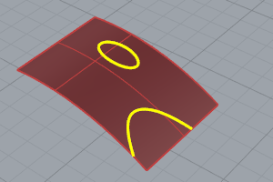
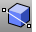
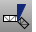
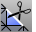

---
---

{: #kanchor2298}
# Split and trim
Split and trim objects with other objects.

## About trimmed surfaces
Surfaces can be trimmed or untrimmed. A trimmed surface has two parts: a surface that underlies everything and defines the geometric shape, and trimming curves that mark sections of the underlying surface that are trimmed away.
Trimmed surfaces are created with commands that trim or split surfaces with curves and other surfaces. Some commands create trimmed surfaces directly.

The shape of a surface is still defined by a set of control points arranged in a rectangular pattern.

Since it can be important for you to know if a surface is trimmed, the [Properties](properties.html) command lists the trimmed or untrimmed state of the surface. Some Rhino commands work only with untrimmed surfaces and some software does not import trimmed [NURBS](http://www.rhino3d.com/nurbs) surfaces.
Trimming curves lie on the underlying surface. This surface may be larger than the trim curves, but you will not see the underlying surface because Rhino does not draw the part of the surface that is outside the trim curves. Every trimmed surface retains information about its underlying surface geometry. You can remove the trimming curve boundaries to make the surface untrimmed with the [Untrim](trim.html#untrim) command.

If you have a trim curve that runs across a surface, the trim curve itself does not have any real relationship to the control point structure of the surface. You can see this if you select such a trimmed surface and turn its control points on. You will see the control points for the whole underlying surface.

If you create a surface from a planar curve, it can be a trimmed surface. The illustrated surface was created from a circle. The control points display shows the rectangular structure of the surface.

The [Untrim](trim.html#untrim) command removes the trimming curve from the surface to get back to the underlying untrimmed rectangular surface.

## Split curves and surfaces
 [Split](split.html) 
Divide objects using other objects as cutters.
 [SplitEdge](splitedge.html) 
Divide a surface edge.
 [SplitFace](splitface.html) 
Divide a planar polysurface face.
 [DivideAlongCreases](dividealongcreases.html) 
Divide a surface into separate parts at kinks.
 [Explode](explode.html) 
Break objects down into components.

## Trim curves and surfaces
 [Trim](trim.html) 
Cut and delete selected portions of an object at the intersection with another object.
 [WireCut](wirecut.html) 
Trim a polysurface with a curve similar to cutting foam with a heated wire.

## Remove trims
 [RemoveEdge](trim.html#removeedge) 
Untrim selected surface edges.
 [Untrim](trim.html#untrim) 
Remove trim curves from trimmed surfaces.
 [UntrimAll](trim.html#untrimall) 
Untrim all edges.
 [UntrimBorder](trim.html#untrimborder) 
Untrim surface border.
 [UntrimHoles](trim.html#untrimholes) 
Untrim interior holes.

## Split and trim meshes
 [MeshSplit](meshsplit.html) 
Divide meshes into parts with another object.
 [MeshTrim](meshtrim.html) 
Delete portions of a mesh inside or outside intersections with another object.
 [SplitMeshEdge](splitmeshedge.html) 
Divide a mesh edge.
 [SplitMeshWithCurve](splitmeshwithcurve.html) 
Divide a mesh with a curve.
 [SplitDisjointMesh](splitdisjointmesh.html) 
Divide into separate objects meshes that do not connect, but are still one object.
See also
 [Boolean objects](sak-boolean.html) 
&#160;
&#160;
Rhinoceros 6 © 2010-2015 Robert McNeel &amp; Associates.11-Nov-2015
 [Open topic with navigation](sak-splittrim.html) 

