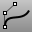

---
---

# Edit surfaces
Edit surfaces with control points and by changing the surface structure.

## Turn surface control points on
 [PointsOn](pointson.html) 
Display curve and surface control points.

## Insert or remove control points
 [InsertControlPoint](insertcontrolpoint.html) 
Add control points to a curve or a row of control points to a surface.
 [InsertKnot](insertknot.html) 
Add knots to curves or surfaces.

## Change control point structure
 [ChangeDegree](changedegree.html) 
Change the degree of the polynomial that defines the curve or surface by adding or subtracting control points between knot spans, while maintaining the knot structure.
 [CreaseSplitting](creasesplitting.html) 
Control whether surface creation commands divide creased surfaces into polysurfaces.
 [FitSrf](fitsrf.html) 
Reduce the number of surface control points.
 [MakeNonPeriodic](makeperiodic.html#makenonperiodic) 
Insert a kink at the start/end of a curve or surface.
 [MakePeriodic](makeperiodic.html) 
Remove the kink from the start/end of a curve or surface.
 [Rebuild](rebuild.html) 
Reconstruct curves, surfaces, and extrusion objects to a specified degree and control point number.
 [RebuildEdges](rebuildedges.html) 
Restore surface edges to their surface.
 [RebuildUV](rebuilduv.html) 
Reconstruct surfaces to a specified control point number in the u or v&#160;directions.
 [ShrinkTrimmedSrf](shrinktrimmedsrf.html) 
Contract the underlying untrimmed surface close to trimming boundaries.
 [ShrinkTrimmedSrfToEdge](shrinktrimmedsrf.html#shrinktrimmedsrftoedge) 
Contract the underlying untrimmed surface as close as possible to the trimming boundaries.
 [Smooth](smooth.html) 
Average the positions of curve and surface [control points](controlpoint.html) and mesh vertices in a specified region and evens out the spacing of selected control points in small increments to remove unwanted detail, and loops in curves and surfaces.
 [SrfSeam](srfseam.html) 
Change the location where the start and end edges meet on a closed surface.
 [Weight](weight.html) 
Edit the weight of a curve or surface control point.

## Change the surface
 [EndBulge](endbulge.html) 
Adjust the shape of a curve at its end or a surface near an untrimmed edge.
 [FlattenSrf](flattensrf.html) 
Project surface edges onto the construction plane to create planar curves.
 [SoftEditSrf](softeditsrf.html) 
Move the surrounding surface area smoothly relative to the distance.
 [Smash](smash.html) 
Flatten a surface without restriction to single-directional curvature.
 [Join](join.html) 
Connect curves, surface edges, or surfaces to form a single object.
 [JoinEdge](joinedge.html) 
Join two naked edges that are out of tolerance.
 [MatchSrf](matchsrf.html) 
Adjust a surface edge to have continuity with another surface edge.
 [MergeAllEdges](mergealledges.html) 
Merge all possible edges of a surface or polysurface.
 [MergeEdge](mergeedge.html) 
Combine adjacent edges of the same surface.
 [MergeSrf](mergesrf.html) 
Combine two surfaces at untrimmed edges.
See also
 [Undo and redo actions](sak-undo.html) 
 [Extend curves and surfaces](sak-extend.html) 
 [Fillet, blend, or chamfer between curves and surfaces](sak-fillet-blend-chamfer.html) 
 [Split and trim curves and surfaces](sak-splittrim.html) 
 [Edit solid objects](sak-solidtools.html) 
 [Create surfaces](sak-surface.html) 
&#160;
&#160;
Rhinoceros 6 © 2010-2015 Robert McNeel &amp; Associates.11-Nov-2015
 [Open topic with navigation](sak-surfacetools.html) 

