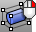
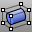
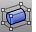

---
---

# Use Universal Deformation Technology to deform objects
Universal Deformation Technology (UDT) allows objects to be stretched, bent, and twisted. The UDT tools allow you to deform meshes, curves, surfaces, polysurfaces, and solids without worrying about the integrity of the object.
 [Bend](bend.html) 
Deform objects along an arc.
 [Cage](cage.html) 
Create a control cage object used by the [CageEdit](cageedit.html) command to deform other objects.
 [CageEdit](cageedit.html) 
Deform objects smoothly using control cage objects.
 [Flow](flow.html) 
Re-align objects from a base curve to a target curve.
 [FlowAlongSrf](flowalongsrf.html) 
Re-align objects from a source surface to a target surface.
 [Maelstrom](maelstrom.html) 
Deform objects in a spiral.
 [ReleaseFromCage](cageedit.html#releasefromcage) 
Remove objects from a control cage.
 [Splop](splop.html) 
Copy, rotate, scale, and wrap objects on a surface.
 [Stretch](stretch.html) 
Scale areas of an object in one direction.
 [Taper](taper.html) 
Deform objects toward or away from an axis.
 [Twist](twist.html) 
Deform objects by rotating portions around an axis.
&#160;
&#160;
Rhinoceros 6 © 2010-2015 Robert McNeel &amp; Associates.11-Nov-2015
 [Open topic with navigation](sak-udt.html) 

