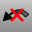

---
---

# Undo and redo actions
Reverse previous actions.
 [Undo](undo.html) 
Undo the last action.
 [UndoMultiple](undo.html#undomultiple) 
Display a list of recent commands to reverse.
 [UndoSelected](undo.html#undoselected) 
Reverse recent changes for a single object only.

## Redo actions
 [Redo](undo.html#redo) 
Reverse the last Undo.
 [RedoMultiple](undo.html#redomultiple) 
Reverse the Undo command multiple times.
See also
 [ClearUndo](clearundo.html) 
Clear the undo buffer to free memory.
 [UndoView](undoview.html) 
Undo the last view change.
 [RedoView](undoview.html#redoview) 
Reverse the last UndoView.
&#160;
&#160;
Rhinoceros 6 © 2010-2015 Robert McNeel &amp; Associates.11-Nov-2015
 [Open topic with navigation](sak-undo.html) 

