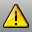

---
---

# Utility functions
 [Alerter](alerter.html) 
Open the Alerter options page.
 [Calc](calc.html) 
Toggle the on-screen calculator.
 [CalcRPN](calc.html#calcrpn) 
Toggle the on-screen RPN (reverse Polish notation) calculator.
 [EarthAnchorPoint](earthanchorpoint.html) 
Add information about the model's position for GIS mapping applications.
 [ModelBasepoint](modelbasepoint.html) 
Set a world origin that is used when inserting the model into another.
 [Purge](purge.html) 
Delete unused block definitions, groups, layers, hatch patterns, linetypes, dimension styles, and materials.
 [RevCloud](revcloud.html) 
Draw revision cloud curves.

## HTML
 [Hyperlink](hyperlink.html) 
Manage URL addresses attached to an object.
 [WebBrowser](webbrowser.html) 
Opens the Web Browser panel.
&#160;
&#160;
Rhinoceros 6 © 2010-2015 Robert McNeel &amp; Associates.11-Nov-2015
 [Open topic with navigation](sak-utilities.html) 

