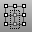
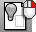

---
---

{: #kanchor2299}
# Manage object visibility
Control object visibility.

## Hide objects
 [CullControlPolygon](cullcontrolpolygon.html) 
Toggle the display of control points that are behind the surface.
 [Hide](hide.html) 
Conceal objects from view.
 [HideInDetail](detail.html#hideindetail) 
Conceal objects in a detail view.
 [HidePt](hide.html#hidept) 
Conceal control and edit points.
 [HideSwap](hide.html#hideswap) 
Conceal all visible objects and re-displays all previously hidden objects.
 [Isolate](hide.html#isolate) 
Hide all but the currently selected objects.

## Show objects
 [Show](hide.html#show) 
Redisplay all hidden objects.
 [ShowSelected](hide.html#showselected) 
Redisplay selected hidden objects.
 [ShowInDetail](detail.html#showindetail) 
Redisplay hidden objects in a detail view.
 [ShowEdges](showedges.html) 
Highlight edges of surfaces and polysurfaces. Displays the Edge Analysis control.
 [ShowPt](hide.html#showpt) 
Redisplay all hidden control points and edit points.

## Lock objects
 [IsolateLock](lock.html#isolatelock) 
Lock all but the currently selected objects.
 [Lock](lock.html) 
Lock objects so they cannot be selected for editing.
 [Unlock](lock.html#unlock) 
Unlock all locked objects.
 [UnlockSelected](lock.html#unlockselected) 
Unlock selected locked objects.
 [LockSwap](lock.html#lockswap) 
Lock all unlocked objects and unlock all previously locked objects.
See also
 [Layer](layer.html) 
Manage layer properties.
&#160;
&#160;
Rhinoceros 6 © 2010-2015 Robert McNeel &amp; Associates.11-Nov-2015
 [Open topic with navigation](sak-visibility.html) 

