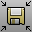

---
---

# Save
{: #kanchor1192}
{: #kanchor1191}
{: #kanchor1190}
{: #kanchor1189}
{: #kanchor1188}
{: #save}
 [Where can I find this command?](javascript:void(0);) Toolbars
 [File](file-toolbar.html)  [Popup](popup-toolbar.html)  [Standard](standard-toolbar.html)  [STL Tools](stl-tools-toolbar.html) 
Menus
File
Save
Shortcut
 [Ctr](ctrl-key.html) +S
The Save command saves the current model.
You can automatically save a backup file each time a model is saved.
See: [Options &gt; Files](files.html#save-bak).
Steps
In theFile namebox, type a name for the file.ClickSave.To save as an earlier version of Rhino
See [Rhino 3DM Earlier Versions](rhino-3dm-export-to-earlier-versions.html) .To save as a different file format
Type the file name with the desired extension.See: [Export](export.html).
{: #save-geometry-only}Options
Save small
Though clearing the render meshes makes the file smaller, it will shade and render more slowly the next time you open the file.
Save geometry only
Saves geometry objects only. No layers, materials, properties, notes, or units settings are saved.
This is similar to exporting the objects. A new file is made, but it does not become your active Rhino model.
Save Textures
Embeds external textures used by materials, environments and decals into the model.
Save plugin data
Saves data attached to objects or the document by plug-in applications.
In the emergency save (out of memory) situation, Rhino automatically attempts to save your current model under a different name and prevent you from saving over your last .3dm file. Search your hard disk for a file named RHINO_EMERGENCY_SAVE.3dm.
Command-line options
To access hidden command-line options
Type ahyphenin front of the command name:-Save.Version
Specifies the Rhino version for the saved file.
SaveSmall
Though clearing the render meshes makes the file smaller, it will shade and render more slowly the next time you open the file.
GeometryOnly
Saves geometry objects only. No layers, materials, properties, notes, or units settings are saved.
This is similar to exporting the objects. A new file is made, but it does not become your active Rhino model.
SaveTextures
Embeds external textures used by materials, environments and decals into the model.
SavePlugInData
Saves data attached to objects or the document by plug-in applications.
Browse
Opens the Save window.

# SaveAs
{: #kanchor1195}
{: #kanchor1194}
{: #kanchor1193}
{: #saveas}
 [Where can I find this command?](javascript:void(0);) Toolbars
 [File](file-toolbar.html)  [STL Tools](stl-tools-toolbar.html) 
Menus
File
Save As
The SaveAs command saves the current model with a different name, closes the current model, and opens the new model.
Options
Options are the same as for the [Save](#save) command.
Command-line options
To access hidden command-line options
Type ahyphenin front of the command name:-Save.Version
Specifies the Rhino version for the saved file.
SaveSmall
Though clearing the render meshes makes the file smaller, it will shade and render more slowly the next time you open the file.
GeometryOnly
Saves geometry objects only. No layers, materials, properties, notes, or units settings are saved.
This is similar to exporting the objects. A new file is made, but it does not become your active Rhino model.
SaveTextures
Embeds external textures used by materials, environments and decals into the model.
SavePlugInData
Saves data attached to objects or the document by plug-in applications.
Browse
Opens the Save window.

# SaveAsTemplate
{: #kanchor1198}
{: #kanchor1197}
{: #kanchor1196}
{: #saveastemplate}
 [Where can I find this command?](javascript:void(0);) Toolbars
 [File](file-toolbar.html) 
Menus
File
Save As Template
The SaveAsTemplate command saves the current model as a [template file](new.html#templates).
Notes
Template files are located in the [Rhino support folder](supportfilelocation.html) .You can change the default location of template files in [Files Options](files.html) .Options
Options are the same as for the [Save](#save) command.
Command-line options
Options are the same as for the [Save](#save) command.
Type-SaveAsTemplateto access command-line options.
# SaveSmall
{: #kanchor1203}
{: #kanchor1202}
{: #kanchor1201}
{: #kanchor1200}
{: #kanchor1199}
{: #savesmall}
 [Where can I find this command?](javascript:void(0);) Toolbars
 [File](file-toolbar.html) 
Menus
File
Save Small
The SaveSmall command saves geometry objects without meshes.
Note
UseSaveSmallwhen you want to save disk space or send the file to someone via e-mail or other electronic media.Your render meshes will regenerate when you [Render](render.html) or [Shade](shade.html) your viewports.If your model takes a long time to shade the first time, save your render meshes. This will save time when opening the file or shading the first time.Command-line options
Type-SaveSmallto access command-line options.Version
Specifies the Rhino version for the saved file.
SaveSmall
Though clearing the render meshes makes the file smaller, it will shade and render more slowly the next time you open the file.
GeometryOnly
Saves geometry objects only. No layers, materials, properties, notes, or units settings are saved.
This is similar to exporting the objects. A new file is made, but it does not become your active Rhino model.
SaveTextures
Embeds external textures used by materials, environments and decals into the model.
SavePlugInData
Saves data attached to objects or the document by plug-in applications.
Browse
Opens the Save window.

# IncrementalSave
{: #kanchor1205}
{: #kanchor1204}
{: #incrementalsave}
 [Where can I find this command?](javascript:void(0);) Toolbars
 [File](file-toolbar.html) 
Menus
File
Incremental Save
The IncrementalSave command saves the model as a new sequentially-numbered version.
The current model is not affected.
Steps
To change the default settings for how the file is saved, use the command-line version (&#8209;IncrementalSave).The settings selected stay in effect for subsequent incremental saves.See also
 [Export](export.html) 
Save selected objects to a new file.
 [ExportWithOrigin](export.html#exportwithorigin) 
Save objects to a new file with a specified origin and construction plane.
 [ExportBitmaps](exportbitmaps.html) 
Create files from bitmaps in the model.
 [OptionsExport](optionsexport.html) 
Save [Options](options.html) settings to a file.
 [Work with files](sak-file.html) 
 [Index of import/export file types](-index-of-import-export-file-types.html) 
&#160;
&#160;
Rhinoceros 6 © 2010-2015 Robert McNeel &amp; Associates.11-Nov-2015
 [Open topic with navigation](save.html) 

