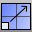

---
---

{: #kanchor1900}{: #kanchor1901}{: #kanchor1902}
# Scale
 [Where can I find this command?](javascript:void(0);) Toolbars
 [Main1](main1-toolbar.html)  [Scale](scale-toolbar.html)  [Transform](transform-toolbar.html) 
Menus
Transform
Scale
Scale 3-D
The Scale command changes the size of selected objects uniformly in the x, y, and z&#160;directions.
Steps
 [Select](select-objects.html) objects. [Pick](pick-location.html) a base point, or press [Enter](enter-key.html) to use the center of the bounding box of all selected objects as the base point.Type the scale factor, or pick two reference points.Your browser does not support the video tag.To scale an object from an arbitrary size to a specific one
Use the origin point and the first reference point to establish the original size of the object.Type the new size for the second reference point.When scaling by dragging, the scale factor becomes the default the next time you use that scale command.Command-line options
Copy
 [&#160;History enabled](historyenabled.html) 
The Copy option specifies whether or not the objects are copied. A plus signappears at the cursor when copy mode is on.
The [RememberCopyOptions](remembercopyoptions.html) command determines whether the selected option is used as the default.
Rigid
The Rigid option specifies that individual objects will not be deformed as they are transformed.
The illustration shows the Rigid option with the Bend command.

Original objects (left), Rigid=No (center), Rigid=Yes (left).
Yes
Individual objects will not change, only their positions will change.
No
Individual objects are transformed as well as their positions.

# Scale1D
{: #scale1d}
 [Where can I find this command?](javascript:void(0);) Toolbars
 [Scale](scale-toolbar.html) 
Menus
Transform
Scale
Scale 1-D
The Scale1D command changes the size of selected objects in one direction.
Steps
 [Select](select-objects.html) objects. [Pick](pick-location.html) a base point, or press [Enter](enter-key.html) to use the center of the bounding box of all selected objects as the base point.Type the scale factor and a direction, or pick two reference points.The objects expand or contract in the single direction specified, without expanding the objects in the other directions.When scaling by dragging, the scale factor becomes the default next time the Scale1D command is used.Your browser does not support the video tag.Command-line options
Copy
 [&#160;History enabled](historyenabled.html) 
The Copy option specifies whether or not the objects are copied. A plus signappears at the cursor when copy mode is on.
The [RememberCopyOptions](remembercopyoptions.html) command determines whether the selected option is used as the default.
Rigid
The Rigid option specifies that individual objects will not be deformed as they are transformed.
The illustration shows the Rigid option with the Bend command.

Original objects (left), Rigid=No (center), Rigid=Yes (left).
Yes
Individual objects will not change, only their positions will change.
No
Individual objects are transformed as well as their positions.

# Scale2D
{: #scale2d}
 [Where can I find this command?](javascript:void(0);) Toolbars
 [Scale](scale-toolbar.html) 
 [Main1Transform](main1-toolbar.html) 
Menus
Transform
Scale
Scale 2-D
The Scale2D command changes the size of selected objects uniformly in two directions.
Steps
 [Select](select-objects.html) objects. [Pick](pick-location.html) a base point, or press [Enter](enter-key.html) to use the center of the bounding box of all selected objects as the base point.Type the scale factor, or pick two reference points.The objects are expanded or contracted uniformly in the two directions of the axes of the active viewport construction plane where you specify the scale factor.When scaling by dragging, the scale factor becomes the default next time the Scale2D command is used.Your browser does not support the video tag.Command-line options
Copy
 [&#160;History enabled](historyenabled.html) 
The Copy option specifies whether or not the objects are copied. A plus signappears at the cursor when copy mode is on.
The [RememberCopyOptions](remembercopyoptions.html) command determines whether the selected option is used as the default.
Rigid
The Rigid option specifies that individual objects will not be deformed as they are transformed.
The illustration shows the Rigid option with the Bend command.

Original objects (left), Rigid=No (center), Rigid=Yes (left).
Yes
Individual objects will not change, only their positions will change.
No
Individual objects are transformed as well as their positions.

# ScaleNU
{: #scalenu}
 [Where can I find this command?](javascript:void(0);) Toolbars
 [Scale](scale-toolbar.html) 
Menus
Transform
Scale
Non-Uniform Scale
The ScaleNU command changes the size of selected objects in three directions using different lengths for each direction.
Steps
 [Select](select-objects.html) objects. [Pick](pick-location.html) an origin.Type the x scale factor, or pick two reference points.(Press [Enter](enter-key.html) for a scale of 1.0.)Type the y scale factor, or pick two reference points.(Press [Enter](enter-key.html) for a scale of 1.0.)Type the z scale factor, or pick two reference points.(Press [Enter](enter-key.html) for a scale of 1.0.)The objects expand or contract in the three directions with the scale factor values specified.Your browser does not support the video tag.Command-line options
Copy
 [&#160;History enabled](historyenabled.html) 
The Copy option specifies whether or not the objects are copied. A plus signappears at the cursor when copy mode is on.
The [RememberCopyOptions](remembercopyoptions.html) command determines whether the selected option is used as the default.
WorldCoordinates
Use [world coordinates](unit-systems.html#world-coordinates) for the scaling direction.
Rigid
The Rigid option specifies that individual objects will not be deformed as they are transformed.
The illustration shows the Rigid option with the Bend command.

Original objects (left), Rigid=No (center), Rigid=Yes (left).
Yes
Individual objects will not change, only their positions will change.
No
Individual objects are transformed as well as their positions.

# ScaleByPlane
{: #scalebyplane}
 [Where can I find this command?](javascript:void(0);) Toolbars
 [Scale](scale-toolbar.html) 
Menus
 [Not on menus.](menuwhattodo.html) 
The ScaleByPlane command changes the size of selected objects in two directions using different lengths for each direction.
Steps
 [Select](select-objects.html) objects. [Pick](pick-location.html) an origin.Type the scale factor, or pick two reference points.The objects are expanded or contracted in two directions along the axes of the specified plane.Your browser does not support the video tag.Command-line options
Copy
 [&#160;History enabled](historyenabled.html) 
The Copy option specifies whether or not the objects are copied. A plus signappears at the cursor when copy mode is on.
The [RememberCopyOptions](remembercopyoptions.html) command determines whether the selected option is used as the default.
Plane
Specifies the plane
ActiveCPlane
Uses the active construction plane as the reference plane.
3Point
Pick three points to specify the reference plane.
Object
Select a planar object to specify the reference plane.
FromView
Uses the specified view plane as the reference plane.
WorldTop
Uses the world x,y plane as the current reference plane.
WorldRight
Uses the world y,z plane as the current reference plane.
WorldFront
Uses the world x,z plane as the current reference plane.
Rigid
The Rigid option specifies that individual objects will not be deformed as they are transformed.
The illustration shows the Rigid option with the Bend command.

Original objects (left), Rigid=No (center), Rigid=Yes (left).
Yes
Individual objects will not change, only their positions will change.
No
Individual objects are transformed as well as their positions.
See also
 [Gumball](gumball.html) 
Displays the gumball widget on a selected object facilitating move, scale, and rotate transformations around the gumball origin.
 [History](history.html) 
Store the connection between a command's input geometry and the result, so that when the input geometry changes, the result updates accordingly.
 [RememberCopyOptions](remembercopyoptions.html) 
Specify whether Copy option on transform commands is stored.
 [Transform objects](sak-transform.html) 
&#160;
&#160;
Rhinoceros 6 © 2010-2015 Robert McNeel &amp; Associates.11-Nov-2015
 [Open topic with navigation](scale.html) 

