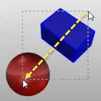
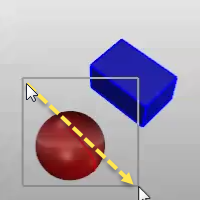

---
---

To select objects
Click the object.Drag right to left for a crossing selection.Drag left to right for a window selection.When multiple objects can be selected, press [Enter](enter-key.html) when you are done selecting.To select sub-object parts with a mouse
For many commands, you can select sub-parts of objects or specified object types to allow you to restrict selection in a tight area.
 [Ctrl](ctrl-key.html) + [Shift](shift-key.html) + [Left mouse](mouse-buttons.html) click, window, or crossing.Examples include:
Curve and surface [control points](controlpoint.html) Polysurface and extrusion faces and edge curvesSurface edge curves [Mesh vertices](meshvertex.html), faces, boundaries, and edgesObjects within a groupPolycurve and polyline segmentsSurface, polysurfaces, and extrusion object vertices. These are the equivalent of the points enabled by [SolidPtOn](pointson.html#solidpton) .See also
 [More about selecting objects](selection-commands.html) 
 [Open topic with navigation](select-objects.html) 

