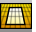
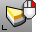

---
---

# Select toolbar
{: #kanchor2375}
 [To open a toolbar](javascript:void(0);) Toolbars can be opened as a free-standing group or added to the current group.
To open a toolbar as a free-standing group
Click theOptionsicon in any toolbar group.On the menu, clickShow Toolbar, and then select the toolbar name from the list.To open a toolbar as a new tab in the current group
Click theOptionsicon in the toolbar group where you want to add the new tab.On the menu, clickShow or Hide Tabs, and then select the toolbar name from the list. [Invert](selection-commands.html#invert) 
Deselect all selected objects and select all previously unselected objects.
 [InvertPt](selection-commands.html#invertpt) 
Deselect all selected control or edit points and select all previously unselected control or edit points.
 [Infinite plane](infiniteplane.html) 
Draw an intersection plane.
 [Lasso](selection-commands.html#lasso) 
Select objects by drawing a freehand shape.
Link to [Select Points toolbar](select-points-toolbar.html) 
 [SelAll](selection-commands.html#selall) 
Select all objects.
 [SelBlockInstance](selection-commands.html#selblockinstance) 
Select all block instances.
 [SelBlockInstanceNamed](selection-commands.html#selblockinstancenamed) 
Select all block instances by name.
 [SelBox](selection-commands.html#selbox) 
Select objects inside, outside, or crossing a box-shaped volume.
 [SelBoundary](selection-commands.html#selboundary) 
Select objects within an existing closed curve.
 [SelBrush](selection-commands.html#selbrush) 
Drag the mouse like a brush stroke to select objects.
 [SelChain](selection-commands.html#selchain) 
Select curve or surface edges that touch end-to-end.
Link to [Select Chain toolbar](select-chain-toolbar.html) 
 [SelCircular](selection-commands.html#selcircular) 
Draw a circle to select objects.
 [SelColor](selection-commands.html#selcolor) 
Select all objects of a specified color.
 [SelCrossing](selection-commands.html#selcrossing) 
Select with a crossing window.
 [SelCrv](selection-commands.html#selcrv) 
Select all curves.
Link to [Select Curves toolbar](select-curves-toolbar.html) 
 [SelDim](selection-commands.html#seldim) 
Select all dimensions.
 [SelText](selection-commands.html#seltext) 
Select all text.
 [SelDot](selection-commands.html#seldot) 
Select all annotation dots.
 [SelDup](selection-commands.html#seldup) 
Select geometrically identical objects.
 [SelDupAll](selection-commands.html#seldupall) 
Select all visible geometrically identical objects.
 [SelectionFilter](selection-commands.html#selectionfilter) 
Restrict a selection mode to specified object types.
 [SelGroup](selection-commands.html#selgroup) 
Select a group by name.
 [SelID](selection-commands.html#selid) 
Select objects by object ID number.
 [SelLast](selection-commands.html#sellast) 
Select the last changed objects.
 [SelLayer](selection-commands.html#sellayer) 
Select all objects on a layer.
 [SelLayerNumber](selection-commands.html#sellayernumber) 
Select objects by layer number.
 [SelLight](selection-commands.html#sellight) 
Select all lights.
 [SelMesh](selection-commands.html#selmesh) 
Select all mesh objects.
Link to [Select Meshes toolbar](select-meshes-toolbar.html) 
 [SelName](selection-commands.html#selname) 
Select objects by name.
 [SelNone](selection-commands.html#selnone) 
Deselect all objects.
 [SelObjectsWithHistory](selection-commands.html#selobjectswithhistory) 
Select objects that have history.
Link to [Select History toolbar](select-history-toolbar.html) 
 [SelPolysrf](selection-commands.html#selpolysrf) 
Select all polysurfaces.
Link to [Select Polysurfaces toolbar](select-polysurfaces-toolbar.html) 
 [SelPrev](selection-commands.html#selprev) 
Re-select the previous selection set.
 [SelPt](selection-commands.html#selpt) 
Select all [point](point.html) objects, [control points](pointson.html), [edit points](pointson.html#editpton), and [solid points](pointson.html#solidpton).
 [SelPtCloud](selection-commands.html#selptcloud) 
Select all point cloud objects.
 [SelSmall](selection-commands.html#selsmall) 
Select all objects smaller than a specified size.
 [SelSrf](selection-commands.html#selsrf) 
Select all surfaces.
Link to [Select Surfaces toolbar](select-surfaces-toolbar.html) 
 [SelVolumeSphere](selection-commands.html#selvolumesphere) 
Select objects inside, outside, or crossing a spherical volume.
 [SelWindow](selection-commands.html#selwindow) 
Select with an enclosing window.
&#160;
&#160;
Rhinoceros 6 © 2010-2015 Robert McNeel &amp; Associates.11-Nov-2015
 [Open topic with navigation](select-toolbar.html) 

