---
---

# Set View toolbar
{: #kanchor2376}
 [To open a toolbar](javascript:void(0);) Toolbars can be opened as a free-standing group or added to the current group.
To open a toolbar as a free-standing group
Click theOptionsicon in any toolbar group.On the menu, clickShow Toolbar, and then select the toolbar name from the list.To open a toolbar as a new tab in the current group
Click theOptionsicon in the toolbar group where you want to add the new tab.On the menu, clickShow or Hide Tabs, and then select the toolbar name from the list. [DollyZoom](dollyzoom.html) 
Move the camera location and change the lens length at the same time.
 [ZoomLens](zoom.html#zoomlens) 
Adjust the lens length of the viewport camera in a perspective view.
 [Isometric](isometric.html) 
Change the current viewport properties to a parallel projection isometric view looking from a specified quadrant toward 0.
Link to [Isometric toolbar](isometric-toolbar.html) 
 [MoveTargetToObjects](movetargettoobjects.html) 
Move the target to the center of selected objects.
 [NamedView](namedview.html) 
Manage the named views.
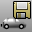 [NamedView, *Save* ](namedview.html#save-as) 
Save a named view.
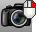 [NamedView, *Restore* ](namedview.html#restore) 
Restore a named view.
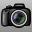 [Named Views panel,Toggle](namedview.html) 
Displays or hides the Named Views panel.
 [OrientCameraToSrf](orientcameratosrf.html) 
Align the view to a surface normal.
 [Pan](pan.html) 
Shift the location of the view camera and target parallel to the view plane.
 [Plan](setview.html#plan) 
Set the viewport to a parallel plan view.
 [PerspectiveMatch](perspectivematch.html) 
Allow matching the view to the Wallpaper image.
 [ReadViewportsFromFile](new-viewport-arrangements.html#readviewportsfromfile) 
Set the viewport layout to match that of another model.
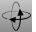 [RotateView](rotateview.html) 
Rotate the view camera around the target.
 [RotateCamera](rotatecamera.html) 
Rotate the view target around the camera.
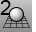 [Set 2-Point Perspective](viewport.html#two-point-perspective) 
Set the projection to two-point perspective.
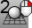 [PerspectiveAngle](perspectiveangle.html) 
Set the viewport field-of-view angle.
 [SetView, *World Back* ](setview.html#worldback) 
Change the view to the world back view.
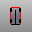 [SetView, *World Bottom* ](setview.html#worldbottom) 
Change the view to the world bottom view.
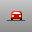 [SetView, *World Front* ](setview.html#worldfront) 
Change the view to the world front view.
 [SetView, *World Left* ](setview.html#worldleft) 
Change the view to the world left view.
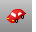 [SetView, *World Perspective* ](setview.html#worldperspective) 
Change the view to the world perspective view.
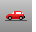 [SetView, *World Right* ](setview.html#worldright) 
Change the view to the world right view.
 [SetView, *World Top* ](setview.html#worldtop) 
Change the view to the world top view.
 [SetView, *CPlane Back* ](setview.html#cplaneback) 
Changes the view to the construction plane back view.
 [SetView, *CPlane Bottom* ](setview.html#cplanebottom) 
Changes the view to the construction plane bottom view.
 [SetView, *CPlane Front* ](setview.html#cplanefront) 
Changes the view to the construction plane front view.
 [SetView, *CPlane Left* ](setview.html#cplaneleft) 
Changes the view to the construction plane left view.
 [SetView, *CPlane Right* ](setview.html#cplaneright) 
Changes the view to the construction plane right view.
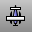 [SetView, *CPlane Top* ](setview.html#cplanetop) 
Changes the view to the construction plane top view.
 [Zoom](zoom.html) 
Move the viewport camera so the area defined by a window selection fills the viewport.
 [Turntable](turntable.html) 
Rotate a view around the target.
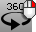 [Turntable, *One cycle* ](turntable.html) 
Rotates a view around the target one time.
 [UndoView](undoview.html) 
Undo the last view change.
 [RedoView](undoview.html#redoview) 
Reverse the last UndoView.
 [Viewport Properties, *Toggle Projection* ](viewport.html#projection-parallel-perspective) 
Toggle between parallel and perspective projection.
 [PerspectiveAngle](perspectiveangle.html) 
Set the viewport field-of-view angle.
 [Viewport properties, *Target* ](viewport.html#target-location) 
Set the viewport target location.
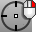 [Viewport properties, *Camera and Target* ](viewport.html#cameraandtarget) 
Set the viewport camera and target locations.
 [WalkAbout](walkabout.html) 
Toggle between WalkAbout and normal navigation modes.
Link to [Walkabout toolbar](walkabout-toolbar.html) 
 [Zoom](zoom.html) 
Move the viewport camera so the area defined by a window selection fills the viewport.
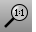 [Zoom 1To1](zoom.html#zoom-1to1) 
Zooms the active viewport so that the view is full scale.
 [Zoom1To1Calibrate](zoom.html#zoom1to1calibrate) 
Calibrate the screen for the Zoom command, 1To1 option.
 [Zoom Dynamic](zoom.html#dynamic) 
Zooms the view as you drag the mouse.
 [Zoom Extents](zoom.html#extents) 
Zooms the view to show all objects.
 [Zoom Extents All](zoom.html#all) 
Zooms the view to show all objects in all viewports.
 [Zoom Selected](zoom.html#selected) 
Zooms the view to show all selected objects.
 [Zoom Selected All](zoom.html#all) 
Zooms all viewports to show all selected objects.
&#160;
&#160;
Rhinoceros 6 © 2010-2015 Robert McNeel &amp; Associates.11-Nov-2015
 [Open topic with navigation](set-view-toolbar.html) 

