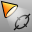

---
---

{: #kanchor1952}{: #kanchor1953}{: #kanchor1954}
# SetSpotlightToView
 [Where can I find this command?](javascript:void(0);) Toolbars
 [Light Tools](light-tools-toolbar.html)  [Render Tools](render-tools-toolbar.html) 
Menus
Render
Set Spotlight to View
The SetSpotlightToView command matches spotlight direction to the viewport camera direction.
The command an existing spotlight or adds a new one so that the light point and target point (center of base circle) correspond to the camera point and its target point. This provides a convenient and accurate way to place or add a spotlight so that it is shining exactly in the right place.
Steps
 [Select](select-objects.html) a spotlight.Your browser does not support the video tag.Command-line option
NewSpotlight
Creates a new light with the current view characteristics instead of modifying an existing light.
See also
 [Lights](lights.html) 
Open the Lights panel.
 [SetViewToSpotlight](setviewtospotlight.html) 
Match the view to a spotlight direction.
&#160;
&#160;
Rhinoceros 6 © 2010-2015 Robert McNeel &amp; Associates.11-Nov-2015
 [Open topic with navigation](setspotlighttoview.html) 

