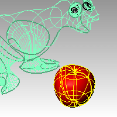

---
---

{: #kanchor1978}{: #kanchor1979}{: #kanchor1980}{: #kanchor1981}
# Shade
 [Where can I find this command?](javascript:void(0);) Toolbars
 [Display](display-toolbar.html)  [Standard](standard-toolbar.html) 
Menus
Render
Shade
The Shade command temporarily shades the viewport.
Steps
Specify shade settings.Click in the viewport, press [Esc](esc-key.html), or start another command to cancel the shaded view.Command-line options
DisplayMode
 [Shaded](view-displaymode-options.html#shaded) 
Sets the viewport to opaque shaded mode.
 [Rendered](view-displaymode-options.html#rendered) 
Shades the viewport with an OpenGL simulation of the rendered view.
 [Ghosted](view-displaymode-options.html#ghosted) 
Sets viewport display so surfaces are translucent.
 [XRay](view-displaymode-options.html#x-ray) 
Shades with [isoparametric curves](isocurve.html) not obscured by objects in front.
DrawCurves
Displays curve objects.
DrawWires
Displays [isoparametric curves](isocurve.html) and edges.
DrawGrid
Displays the grid.
DrawAxes
Displays the construction plane axes.

# ShadeSelected
{: #shadeselected}
 [Where can I find this command?](javascript:void(0);) Toolbars
 [Not on toolbars.](toolbarwhattodo.html) 
Menus
View
 [Viewport title](rhino-window.html#viewport-title-menu) 
Shade Selected Objects Only
TheShadeSelectedcommand togglesShadeSelectedmode.

Note
TheShadeSelectedcommand sets the viewport display mode to shade only selected surfaces, polysurfaces, and meshes.Only selected surfaces, polysurfaces, solids, and meshes are shaded.Viewport display modes can be customized.See: [Display Modes Options](view-displaymode-options.html).
See also
 [Set viewport display modes](sak-displaymodes.html) 
&#160;
&#160;
Rhinoceros 6 © 2010-2015 Robert McNeel &amp; Associates.11-Nov-2015
 [Open topic with navigation](shade.html) 

